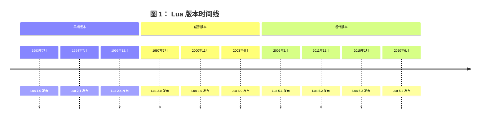

# The Evolution of Lua

| Roberto Ierusalimschy                                           | Luiz Henrique de Figueiredo                                    | Waldemar Celes                                                  |
| --------------------------------------------------------------- | -------------------------------------------------------------- | --------------------------------------------------------------- |
| Department of Computer Science, PUC-Rio, Rio de Janeiro, Brazil | IMPA–Instituto Nacional de Matem´atica Pura e Aplicada, Brazil | Department of Computer Science, PUC-Rio, Rio de Janeiro, Brazil |
| [roberto@inf.puc-rio.br]                                        | [lhf@impa.br]                                                  | [celes@inf.puc-rio.br]                                          |

## Abstract

我们报告了 Lua 语言的诞生和演变，并讨论了它如何从一个简单的配置语言发展成为一种多功能、广泛使用的语言，支持可扩展的语义、匿名函数、完整的词法作用域、适当的尾调用以及协程。

分类与主题描述符 K.2 [计算机历史]: 软件；D.3 [编程语言]

## 1. Introduction

Lua 是一种脚本语言，于 1993 年诞生于巴西里约热内卢的天主教大学（PUC-Rio）。自那时起，Lua 不断发展，现已被广泛应用于各种工业领域，如机器人技术、文学编程、分布式业务、图像处理、可扩展文本编辑器、以太网交换机、生物信息学、有限元分析软件包、网络开发等 [^2]。特别是在游戏开发领域，Lua 已成为领先的脚本语言之一。

Lua 的发展远远超出了我们最乐观的预期。事实上，尽管几乎所有的编程语言都源自北美和西欧（除了来自日本的 Ruby 这一显著例外）[^4]，Lua 是唯一一个在发展中国家创建并取得全球影响力的语言。

从一开始，Lua 就被设计为简单、小巧、可移植、快速且易于嵌入应用程序中。这些设计原则至今仍然有效，我们相信它们正是 Lua 在工业领域取得成功的原因。Lua 的主要特点及其简洁性的生动体现，在于它提供了一种单一的数据结构 —— 表（table），这是 Lua 对关联数组的称呼 [^9]。尽管大多数脚本语言都提供关联数组，但在其他语言中，关联数组并未扮演如此核心的角色。Lua 的表为模块、基于原型的对象、基于类的对象、记录、数组、集合、包、列表以及许多其他数据结构提供了简单而高效的实现 [^28]。

在本文中，我们报告了 Lua 的诞生与演变。我们探讨了 Lua 如何从一个简单的配置语言发展成为一种强大（但仍保持简洁）的语言，支持可扩展的语义、匿名函数、完整的词法作用域、适当的尾调用以及协程。在 §2 中，我们概述了 Lua 的主要概念，这些概念将在其他章节中用于讨论 Lua 的演变过程。在 §3 中，我们回顾了 Lua 的 “史前史”，即导致其诞生的背景。在 §4 中，我们讲述了 Lua 的诞生过程、其最初的设计目标以及第一个版本的功能。 §5 讨论了 Lua 如何以及为何演变，而 §6 则对部分特性的演变进行了详细探讨。本文在 §7 中以对 Lua 演变的回顾作为结尾，并在 §8 中简要讨论了 Lua 成功的原因，尤其是在游戏领域中的成功。

## 2. Overview

在本节中，我们简要概述了 Lua 语言，并介绍了在 §5 和 §6 中讨论的概念。关于 Lua 的完整定义，请参阅其参考手册 [^32]。如需详细了解 Lua，请参阅 Roberto 的书籍 [^28]。为了具体化，我们将描述 Lua 5.1，这是本文撰写时（2007 年 4 月）的最新版本，但本节的大部分内容同样适用于之前的版本。

从语法上看，Lua 与 Modula 相似，并使用常见的关键字。为了展示 Lua 的语法，以下代码展示了两种实现阶乘函数的方式，一种是递归实现，另一种是迭代实现。任何具备基本编程知识的人可能无需解释就能理解这些示例。

```lua
-- 递归实现
function factorial (n)
    if n == 0 then
        return 1
    else
        return n * factorial (n - 1)
    end
end

-- 迭代实现
function factorial (n)
    local result = 1
    for i = 2, n do
        result = result * i
    end
    return result
end
```

从语义上看，Lua 与 Scheme 有许多相似之处，尽管这些相似性并不显而易见，因为两种语言在语法上差异很大。在 Lua 的演变过程中，Scheme 对其影响逐渐增强：最初，Scheme 只是背景中的一种语言，但后来它逐渐成为重要的灵感来源，尤其是在引入匿名函数和完整的词法作用域之后。

与 Scheme 类似，Lua 是动态类型的：变量没有类型，只有值有类型。与 Scheme 一样，Lua 中的变量从不包含结构化值，而只是对它们的引用。与 Scheme 一样，函数名在 Lua 中没有特殊地位：它只是一个普通的变量，恰好引用了一个函数值。实际上，上面使用的函数定义语法 `function foo ()・・・end` 只是将匿名函数赋值给变量的语法糖：`foo = function ()・・・end`。与 Scheme 一样，Lua 具有词法作用域的一等函数。实际上，Lua 中的所有值都是一等值：它们可以赋值给全局变量和局部变量，存储在表中，作为参数传递给函数，并从函数中返回。

Lua 与 Scheme 之间的一个重要语义差异 —— 可能也是 Lua 的主要区别特征 —— 是 Lua 将表（table）作为其唯一的数据结构机制。Lua 的表是关联数组 [^9]，但具有一些重要特性。与 Lua 中的所有值一样，表是一等值：它们不像 Awk 和 Perl 中那样绑定到特定的变量名。表可以使用任何值作为键，并可以存储任何值。表通过使用字段名作为键，可以简单高效地实现记录；通过使用集合元素作为键，可以实现集合；还可以实现通用链表结构以及许多其他数据结构。此外，我们可以通过使用自然数作为索引，用表来实现数组。精心设计的实现 [^31] 确保这样的表与数组占用相同的内存（因为它在内部表示为实际的数组），并且在独立基准测试中表现优于类似语言中的数组 [^1]。

Lua 提供了一种表达力丰富的语法来创建表，即构造函数。最简单的构造函数是表达式 {}，它会创建一个新的空表。还有一些构造函数用于创建列表（或数组），例如：`{"Sun","Mon","Tue","Wed","Thu","Fri","Sat"}` 以及用于创建记录，例如：`{lat= -22.90, long= -43.23, city="Rio de Janeiro"}`。这两种形式可以自由混合使用。表使用方括号进行索引，例如 `t [2]`，而 `t.x` 则是 `t ["x"]` 的语法糖。

表构造函数与函数的结合使 Lua 成为一种强大的通用过程式数据描述语言。例如，一个类似于 BibTEX [^34] 格式的文献数据库可以写成一系列表构造函数，如下所示：

```lua
article {"spe96"
    authors = {
        "Roberto Ierusalimschy",
        "Luiz Henrique de Figueiredo",
        "Waldemar Celes" },
    title = "Lua: an Extensible Extension Language",
    journal = "Software: Practics & Experience",
    year = 1996
}
```

尽管这样的数据库看起来是一个静态的数据文件，但它实际上是一个有效的 Lua 程序：当数据库被加载到 Lua 中时，其中的每一项都会调用一个函数，因为 `article {・・・}` 是 `article ({・・・})` 的语法糖，即一个以表为唯一参数的函数调用。正是在这个意义上，这类文件被称为过程式数据文件（procedural data files）。

我们说 Lua 是一种可扩展的扩展语言 [^30]。它是一种扩展语言，因为它通过配置、宏和其他终端用户定制来帮助扩展应用程序。Lua 被设计为嵌入到宿主应用程序中，以便用户可以通过编写 Lua 程序来控制应用程序的行为，这些程序可以访问应用程序服务并操作应用程序数据。它是可扩展的，因为它提供了用户数据（userdata）值来保存应用程序数据，并提供了可扩展的语义机制以自然的方式操作这些值。Lua 作为一个小的核心提供，可以通过用 Lua 和 C 编写的用户函数进行扩展。特别是，输入输出、字符串操作、数学函数和操作系统接口都作为外部库提供。

Lua 的其他显著特征来自其实现：

**可移植性：** Lua 易于构建，因为它是用严格的 ANSI C 实现的。它在大多数平台（如 Linux、Unix、Windows、Mac OS X 等）上可以开箱即用，并且在我们所知的所有平台上（包括移动设备，如手持计算机和手机，以及嵌入式微处理器，如 ARM 和 Rabbit）只需进行少量调整即可运行。为了确保可移植性，我们努力在尽可能多的编译器下实现无警告编译。

**易于嵌入：** Lua 的设计目标是易于嵌入到应用程序中。Lua 的一个重要部分是一个定义良好的应用程序编程接口（API），它允许 Lua 代码与外部代码之间进行完全通信。特别是，通过从宿主应用程序导出 C 函数来扩展 Lua 非常容易。该 API 不仅允许 Lua 与 C 和 C++ 接口，还可以与其他语言（如 Fortran、Java、Smalltalk、Ada、C#（.Net））甚至其他脚本语言（如 Perl 和 Ruby）进行交互。

**小巧的体积：** 将 Lua 添加到应用程序中不会使其变得臃肿。整个 Lua 发行版，包括源代码、文档和一些平台的二进制文件，始终可以轻松地存放在一张软盘上。Lua 5.1 的压缩包（包含源代码、文档和示例）压缩后为 208K，解压后为 835K。源代码包含约 17,000 行 C 代码。在 Linux 下，使用所有标准 Lua 库构建的 Lua 解释器大小为 143K。大多数其他脚本语言的相应数字要大一个数量级以上，部分原因是 Lua 主要设计为嵌入应用程序中，因此其官方发行版仅包含少量库。而其他脚本语言则设计为独立使用，并包含许多库。

**高效性：** 独立基准测试 [^1] 显示，Lua 是解释型脚本语言领域中最快的语言之一。这使得应用程序开发者可以用 Lua 编写整个应用程序的相当大一部分。例如，Adobe Lightroom 中有超过 40% 的代码是用 Lua 编写的（约 10 万行 Lua 代码）。

尽管这些是特定实现的特点，但它们之所以可能，完全归功于 Lua 的设计。特别是，Lua 的简洁性是实现小巧高效的关键因素 [^31]。

## 3. Prehistory

Lua 于 1993 年诞生于巴西里约热内卢天主教大学（PUC-Rio）的计算机图形技术组（Tecgraf）。Lua 的创造者是 Roberto Ierusalimschy、Luiz Henrique de Figueiredo 和 Waldemar Celes。Roberto 当时是 PUC-Rio 计算机科学系的助理教授，Luiz Henrique 是博士后研究员，先在 IMPA（巴西纯数学与应用数学研究所）工作，后来加入 Tecgraf，而 Waldemar 是 PUC-Rio 计算机科学系的博士生。他们三人都是 Tecgraf 的成员，在共同开发 Lua 之前，分别参与不同的项目。他们的背景不同但相关：Roberto 是一位主要对编程语言感兴趣的计算机科学家；Luiz Henrique 是一位对软件工具和计算机图形学感兴趣的数学家；Waldemar 则是一位对计算机图形学应用感兴趣的工程师。（2001 年，Waldemar 加入 Roberto 成为 PUC-Rio 的教职员工，而 Luiz Henrique 则成为 IMPA 的研究员。）

Tecgraf 是一个拥有多个工业合作伙伴的大型研发实验室。自 1987 年 5 月成立后的头十年里，Tecgraf 主要致力于构建基础软件工具，以满足其客户对交互式图形程序的需求。因此，Tecgraf 的早期产品包括图形终端、绘图仪和打印机的驱动程序、图形库以及图形界面工具包。从 1977 年到 1992 年，巴西出于民族主义情绪，认为巴西能够并且应该生产自己的硬件和软件，因此对计算机硬件和软件实施了严格的贸易壁垒政策（称为 “市场保留”）。在这种背景下，Tecgraf 的客户在政治和经济上都无法承担从国外购买定制软件的费用：根据市场保留规则，他们必须通过复杂的官僚程序证明巴西公司无法满足他们的需求。再加上巴西与其他研发中心自然的地理隔离，这些原因促使 Tecgraf 从头开始实现其所需的基础工具。

Tecgraf 最大的合作伙伴之一（至今仍是）是巴西石油公司 Petrobras。Tecgraf 的多个产品是为 Petrobras 的工程应用开发的交互式图形程序。到 1993 年，Tecgraf 已经为其中两个应用程序开发了小型语言：一个是数据输入应用程序，另一个是用于岩性剖面分析的可配置报告生成器。这两种语言分别称为 DEL 和 SOL，它们是 Lua 的前身。我们在此简要描述它们，以展示 Lua 的起源。

### 3.1 DEL

Petrobras 的工程师每天需要多次为数值模拟器准备输入数据文件。这一过程既枯燥又容易出错，因为模拟程序是遗留代码，需要严格格式化的输入文件 —— 通常是纯数字列，没有任何说明每个数字的含义，这种格式源自打孔卡时代。1992 年初，Petrobras 要求 Tecgraf 为这类数据输入创建至少十几个图形前端。数字将通过点击描述模拟的图表的相关部分进行交互式输入 —— 这对工程师来说比编辑数字列要容易得多且更有意义。模拟器所需格式的数据文件将自动生成。除了简化数据文件的创建，这些前端还提供了数据验证的机会，并可以从输入数据中计算派生量，从而减少用户需要输入的数据量，并提高整个过程的可靠性。

为了简化这些前端的开发，由 Luiz Henrique de Figueiredo 和 Luiz Cristovão Gomes Coelho 领导的团队决定以统一的方式编写所有前端，并因此设计了 DEL（“数据输入语言”），这是一种简单的声明式语言，用于描述每个数据输入任务 [^17]。DEL 是现在所谓的领域特定语言 [^43]，但在当时简称为小型语言 [^10]。

典型的 DEL 程序定义了多个 “实体”。每个实体可以有多个字段，这些字段都有名称和类型。为了实现数据验证，DEL 包含谓词语句，用于对实体的值施加限制。DEL 还包括指定数据输入和输出方式的语句。DEL 中的实体本质上就是传统编程语言中的结构体或记录。重要的区别在于 —— 这也是 DEL 适合数据输入问题的原因 —— 实体名称也出现在一个单独的图形元文件中，该文件包含相关的图表，工程师在此图表上进行数据输入。一个名为 ED（“entrada de dados” 的缩写，葡萄牙语中意为 “数据输入”）的交互式图形解释器被编写出来，用于解释 DEL 程序。Petrobras 要求的所有数据输入前端都被实现为在此单一图形应用程序下运行的 DEL 程序。

DEL 在 Tecgraf 的开发人员和 Petrobras 的用户中都取得了成功。在 Tecgraf，DEL 如最初预期的那样简化了前端的开发。在 Petrobras，DEL 允许用户根据他们的需求定制数据输入应用程序。很快，用户开始要求 DEL 具备更多功能，例如用于控制实体是否处于输入状态的布尔表达式，DEL 因此变得更加复杂。当用户开始要求控制流（如条件语句和循环）时，很明显 ED 需要一个真正的编程语言，而不是 DEL。

### 3.2 SOL

大约在 DEL 创建的同时，由 Roberto Ierusalimschy 和 Waldemar Celes 领导的团队开始开发 PGM，这是一个用于岩性剖面分析的可配置报告生成器，同样是为 Petrobras 开发的。PGM 生成的报告由多个列（称为 “轨道”）组成，并且具有高度可配置性：用户可以创建和定位轨道，并选择颜色、字体和标签；每个轨道可以有一个网格，网格也有其一系列选项（对数 / 线性、垂直和水平刻度等）；每条曲线都有自己的比例尺，在溢出情况下必须自动调整；等等。所有这些配置都需要由终端用户完成，通常是 Petrobras 在石油工厂和海上平台工作的地质学家和工程师。配置需要存储在文件中以便重复使用。团队决定，配置 PGM 的最佳方式是通过一种称为 SOL（Simple Object Language 的缩写）的专用描述语言。

由于 PGM 需要处理许多不同的对象，每个对象都有许多不同的属性，SOL 团队决定不将这些对象和属性固定在语言中。相反，SOL 允许类型声明，如下面的代码所示：

```SOL
type @track{ x:number, y:number=23, id=0 }
type @line{ t:@track=@track{x=8}, z:number* }
T = @track{ y=9, x=10, id="1992-34" }
L = @line{ t=@track{x=T.y, y=T.x}, z=[2,3,4] }
```

这段代码定义了两个类型：`track` 和 `line`，并创建了两个对象：一个轨道 `T` 和一条线 `L`。track 类型包含两个数值属性 `x` 和 `y`，以及一个无类型属性 `id`；属性 `y` 和 `id` 具有默认值。`line` 类型包含一个轨道 `t` 和一个数字列表 `z`。轨道 `t` 的默认值为 `x=8`、`y=23` 和 `id=0` 的轨道。SOL 的语法深受 BibTEX [^34] 和 UIL（一种用于描述 Motif 用户界面的语言）[^39] 的影响。

SOL 解释器的主要任务是读取报告描述，检查给定的对象和属性是否类型正确，然后将信息传递给主程序（PGM）。为了实现主程序和 SOL 解释器之间的通信，解释器被实现为一个 C 库，并与主程序链接。主程序可以通过该库中的 API 访问所有配置信息。特别是，主程序可以为每种类型注册一个回调函数，SOL 解释器会调用该函数来创建该类型的对象。

## 4. Birth

SOL 团队在 1993 年 3 月完成了 SOL 的初始实现，但他们从未交付它。PGM 很快需要支持过程式编程，以允许创建更复杂的布局，而 SOL 将不得不进行扩展。与此同时，如前所述，ED 用户要求 DEL 具备更多功能。ED 还需要进一步的描述性功能来编程其用户界面。大约在 1993 年年中，Roberto、Luiz Henrique 和 Waldemar 聚在一起讨论 DEL 和 SOL，并得出结论：这两种语言可以被一种更强大的单一语言取代，他们决定设计和实现这种语言。于是，Lua 团队诞生了；自那以后，团队一直未变。

根据 ED 和 PGM 的需求，我们决定需要一种真正的编程语言，具备赋值、控制结构、子程序等功能。该语言还应提供数据描述功能，例如 SOL 所提供的功能。此外，由于该语言的许多潜在用户并非专业程序员，语言应避免晦涩的语法和语义。新语言的实现应具有高度可移植性，因为 Tecgraf 的客户拥有多样化的计算机平台。最后，由于我们预计其他 Tecgraf 产品也需要嵌入脚本语言，新语言应遵循 SOL 的范例，并作为一个具有 C API 的库提供。

当时，我们可以选择采用现有的脚本语言，而不是创建一种新语言。1993 年，唯一真正的竞争者是 Tcl [^40]，它被明确设计为嵌入应用程序中。然而，Tcl 的语法不够直观，对数据描述的支持也不够完善，并且只能在 Unix 平台上运行。我们没有考虑 LISP 或 Scheme，因为它们的语法不够友好。Python 当时还处于起步阶段。在 Tecgraf 当时盛行的自由、自己动手的氛围中，尝试开发我们自己的脚本语言是很自然的。因此，我们开始着手开发一种新语言，希望它比现有语言更简单易用。我们最初的设计决策是：保持语言简单小巧，并保持实现简单且可移植。由于新语言部分灵感来自 SOL（葡萄牙语中的 “太阳”），Tecgraf 的一位朋友（Carlos Henrique Levy）建议将其命名为 “Lua”（葡萄牙语中的 “月亮”），于是 Lua 诞生了。（DEL 并未直接影响 Lua 作为一门语言的设计。DEL 对 Lua 诞生的主要影响在于让我们意识到，复杂应用程序的很大部分可以通过嵌入式脚本语言来实现。）

我们想要一种轻量级但功能完备的语言，并具备数据描述能力。因此，我们采用了 SOL 中用于记录和列表构造的语法（但不包括类型声明），并通过表（table）统一了它们的实现：记录使用字符串（字段名）作为索引；列表使用自然数作为索引。例如，像这样的赋值语句：

```SOL
T = @track{ y=9, x=10, id="1992-34" }
```

在 SOL 中有效的语法，在 Lua 中仍然有效，但含义不同：它创建了一个对象（即一个表），并包含给定的字段，然后调用函数 track 对这个表进行验证，或者为某些字段提供默认值。该表达式的最终值就是这个表。

除了其过程式数据描述结构外，Lua 并未引入新的概念：Lua 是为实际生产使用而创建的，而不是作为一种支持编程语言研究的学术语言。因此，我们只是简单借鉴了（甚至无意识地）我们在其他语言中见过或读过的内容。我们没有重新阅读旧论文来回忆现有语言的细节，而是从我们对其他语言的了解出发，并根据我们的喜好和需求进行了调整。

我们很快确定了一小组控制结构，其语法主要借鉴了 Modula（如 `while`、`if` 和 `repeat until`）。从 CLU 中我们借鉴了多重赋值和函数调用中的多重返回值。我们将多重返回值视为 Pascal 和 Modula 中使用的引用参数以及 Ada 中使用的输入输出参数的更简单替代方案；我们还希望避免使用显式指针（如 C 语言中的指针）。从 C++ 中我们借鉴了允许局部变量在需要时才声明的巧妙想法。从 SNOBOL 和 Awk 中我们借鉴了关联数组，并将其称为表（tables）；然而，在 Lua 中，表是对象，而不是像 Awk 中那样绑定到变量。

Lua 中为数不多（且相对较小）的创新之一是字符串连接的语法。自然的 `+` 运算符会引发歧义，因为我们希望在算术操作中自动将字符串强制转换为数字。因此，我们发明了 `..`（两个点）作为字符串连接的语法。

一个有争议的点是分号的使用。我们认为，对于有 Fortran 背景的工程师来说，要求使用分号可能会有些困惑，但不允许使用分号又会让有 C 或 Pascal 背景的工程师感到困惑。典型的委员会风格下，我们决定让分号成为可选项。

最初，Lua 有七种类型：数字（仅实现为实数）、字符串、表（tables）、nil、用户数据（指向 C 对象的指针）、Lua 函数和 C 函数。为了保持语言的简洁，我们最初没有包含布尔类型：与 Lisp 一样，nil 表示假，其他任何值表示真。在 13 年的持续演变中，Lua 类型的唯一变化是在 Lua 3.0（1997 年）中将 Lua 函数和 C 函数统一为单一的函数类型，以及在 Lua 5.0（2003 年）中引入布尔类型和线程类型（见 §6.1）。为了简单起见，我们选择使用动态类型而不是静态类型。对于需要类型检查的应用程序，我们提供了基本的反射功能，例如运行时类型信息和全局环境的遍历，作为内置函数（见 §6.11）。

到 1993 年 7 月，Waldemar 完成了 Lua 的第一个实现，这是由 Roberto 指导的课程项目。该实现遵循了如今成为极限编程核心的信条：“最简单的可能有效的方法”[^7]。词法分析器使用 lex 编写，解析器使用 yacc 编写，这是实现语言的经典 Unix 工具。解析器将 Lua 程序翻译为基于栈的虚拟机的指令，然后由一个简单的解释器执行。C API 使得向 Lua 添加新函数变得非常容易，因此第一个版本仅提供了一个包含五个内置函数（`next`、`nextvar`、`print`、`tonumber`、`type`）的小型库和三个小型外部库（输入输出、数学函数和字符串操作）。

尽管实现简单 —— 或者可能正是因为其简单 ——Lua 的表现超出了我们的预期。PGM 和 ED 都成功使用了 Lua（PGM 至今仍在使用；ED 被 EDG [^12] 取代，后者大部分是用 Lua 编写的）。Lua 在 Tecgraf 内部立即取得了成功，很快其他项目也开始使用它。1993 年 10 月，在第七届巴西软件工程研讨会上，我们简要报告了 Lua 在 Tecgraf 的初步使用情况 [^29]。

本文的其余部分将讲述我们在改进 Lua 过程中的历程。

## 5. History

图 1 展示了 Lua 各版本发布的时间线。可以看出，自 Lua 3.0 以来，版本之间的时间间隔逐渐增加。这反映了我们的认识：Lua 正在成为一个成熟的产品，为了其不断增长的社区利益，需要保持稳定性。然而，对稳定性的需求并未阻碍进步。自那时以来，Lua 4.0 和 Lua 5.0 等主要新版本已经发布。



版本之间的长时间间隔也反映了我们的发布模式。与其他开源项目不同，我们的 alpha 版本非常稳定，而 beta 版本基本上就是最终版本，除非发现未覆盖的 bug。这种发布模式被证明对 Lua 的稳定性非常有利。许多产品已经使用了 Lua 的 alpha 或 beta 版本，并且运行良好。然而，这种发布模式并没有给用户太多机会去尝试新版本；它也使我们无法及时获得对拟议更改的反馈。因此，在 Lua 5.0 的开发过程中，我们开始发布 “工作” 版本，这些版本只是 Lua 当前开发的快照。这一举措使我们的发布模式更接近开源社区的 “早发布，常发布” 口号。

在本节的剩余部分，我们将讨论 Lua 演变过程中的一些重要里程碑。关于几个具体特性的演变细节将在 §6 中详细说明。表 1 总结了这一演变过程，并包含了 Lua 代码规模的统计数据，我们现在简要讨论这些数据。

标准库的数量一直保持在较少的水平，因为我们预计大多数 Lua 函数将由宿主应用程序或第三方库提供。在 Lua 3.1 之前，唯一的标准库是用于输入输出、字符串操作、数学函数以及一个特殊的内置函数库，这些内置函数库不使用 C API，而是直接访问内部数据结构。从那时起，我们陆续添加了用于调试（Lua 3.2）、与操作系统接口（Lua 4.0）、表和协程（Lua 5.0）以及模块（Lua 5.1）的库。

|                                |  1.0  |  1.1  |  2.1  |  2.2  |  2.4  |  2.5  |  3.0  |  3.1  |  3.2  |  4.0  |  5.0  |  5.1  |
| ------------------------------ | :---: | :---: | :---: | :---: | :---: | :---: | :---: | :---: | :---: | :---: | :---: | :---: |
| constructors                   |   •   |   •   |   •   |   •   |   •   |   •   |   •   |   •   |   •   |   •   |   •   |   •   |
| garbage collection             |   •   |   •   |   •   |   •   |   •   |   •   |   •   |   •   |   •   |   •   |   •   |   •   |
| extensible semantics           |       |       |   •   |   •   |   •   |   •   |   •   |   •   |   •   |   •   |   •   |   •   |
| support for OOP                |       |       |   •   |   •   |   •   |   •   |   •   |   •   |   •   |   •   |   •   |   •   |
| long strings                   |       |       |       |   •   |   •   |   •   |   •   |   •   |   •   |   •   |   •   |   •   |
| debug API                      |       |       |       |   •   |   •   |   •   |   •   |   •   |   •   |   •   |   •   |   •   |
| external compiler              |       |       |       |       |   •   |   •   |   •   |   •   |   •   |   •   |   •   |   •   |
| vararg functions               |       |       |       |       |       |   •   |   •   |   •   |   •   |   •   |   •   |   •   |
| pattern matching               |       |       |       |       |       |   •   |   •   |   •   |   •   |   •   |   •   |   •   |
| conditional compilation        |       |       |       |       |       |       |   •   |   •   |   •   |       |       |       |
| anonymous functions, closures  |       |       |       |       |       |       |       |   •   |   •   |   •   |   •   |   •   |
| debug library                  |       |       |       |       |       |       |       |       |   •   |   •   |   •   |   •   |
| multi-state API                |       |       |       |       |       |       |       |       |       |   •   |   •   |   •   |
| for statement                  |       |       |       |       |       |       |       |       |       |   •   |   •   |   •   |
| long comments                  |       |       |       |       |       |       |       |       |       |       |   •   |   •   |
| full lexical scoping           |       |       |       |       |       |       |       |       |       |       |   •   |   •   |
| booleans                       |       |       |       |       |       |       |       |       |       |       |   •   |   •   |
| coroutines                     |       |       |       |       |       |       |       |       |       |       |   •   |   •   |
| incremental garbage collection |       |       |       |       |       |       |       |       |       |       |       |   •   |
| module system                  |       |       |       |       |       |       |       |       |       |       |       |   •   |

|                            |  1.0  |  1.1  |  2.1  |  2.2  |  2.4  |  2.5  |  3.0  |  3.1  |  3.2  |  4.0  |  5.0  |  5.1  |
| -------------------------- | :---: | :---: | :---: | :---: | :---: | :---: | :---: | :---: | :---: | :---: | :---: | :---: |
| libraries                  |   4   |   4   |   4   |   4   |   4   |   4   |   4   |   4   |   5   |   6   |   8   |   9   |
| built-in functions         |   5   |   7   |  11   |  11   |  13   |  14   |  25   |  27   |  35   |   0   |   0   |   0   |
| API functions              |  30   |  30   |  30   |  30   |  32   |  32   |  33   |  47   |  41   |  60   |  76   |  79   |
| vm type (stack × register) |   S   |   S   |   S   |   S   |   S   |   S   |   S   |   S   |   S   |   S   |   R   |   R   |
| vm instructions            |  64   |  65   |  69   |  67   |  67   |  68   |  69   |  128  |  64   |  49   |  35   |  38   |
| keywords                   |  16   |  16   |  16   |  16   |  16   |  16   |  16   |  16   |  16   |  18   |  21   |  21   |
| other tokens               |  21   |  21   |  23   |  23   |  23   |  23   |  24   |  25   |  25   |  25   |  24   |  26   |

<center><b>表 1. Lua 功能的演变</b></center>

在 Lua 4.0 中，C API 经历了重大重新设计，其规模发生了显著变化。从那时起，C API 逐渐趋于完善。因此，Lua 不再有任何内置函数：所有标准库都基于 C API 实现，而无需访问 Lua 的内部结构。

执行 Lua 程序的虚拟机在 Lua 4.0 之前是基于栈的。在 Lua 3.1 中，我们为许多指令添加了变体，试图提高性能。然而，事实证明这过于复杂，且性能提升有限，因此在 Lua 3.2 中我们移除了这些变体。从 Lua 5.0 开始，虚拟机改为基于寄存器 [^31]。这一变化为代码生成器提供了更多优化机会，并减少了典型 Lua 程序的指令数量。（指令调度是虚拟机执行时间的重要组成部分 [^13]。）据我们所知，Lua 5.0 的虚拟机是第一个广泛使用的基于寄存器的虚拟机。

### 5.1 Lua 1

Lua 的初始实现在 Tecgraf 中取得了成功，并吸引了其他 Tecgraf 项目的用户。新用户带来了新的需求。一些用户希望将 Lua 用作图形元文件的支持语言，这在 Tecgraf 中非常普遍。与其他可编程元文件相比，Lua 元文件的优势在于它基于一种真正的过程式语言：通过将过程式代码片段与声明式语句结合，可以自然地建模复杂对象。相比之下，例如 VRML [^8] 必须使用另一种语言（Javascript）来建模过程式对象。

将 Lua 用于此类数据描述，尤其是大型图形元文件，提出了对典型脚本语言来说不常见的挑战。例如，在数据输入程序 ED 中使用的图表通常有数千个部分，这些部分由一个包含数千个项目的 Lua 表构造函数描述。这意味着 Lua 必须能够处理巨大的程序和巨大的表达式。由于 Lua 会即时将所有程序预编译为虚拟机的字节码，这也意味着 Lua 编译器必须运行得非常快，即使对于大型程序也是如此。

通过将第一版中使用的 lex 生成的扫描器替换为手写的扫描器，我们几乎将 Lua 编译器在典型元文件上的速度提高了一倍。我们还修改了 Lua 的虚拟机，使其能够通过批量添加键值对来处理长构造函数，而不是像原始虚拟机那样逐个添加。这些变化满足了最初对更好性能的需求。从那时起，我们一直致力于减少预编译所花费的时间。

1994 年 7 月，我们发布了包含这些优化的 Lua 新版本。该版本发布的同时，我们发表了第一篇描述 Lua 及其设计和实现的论文 [^15]。我们将新版本命名为 “Lua 1.1”。之前的版本从未公开发布，后来被命名为 “Lua 1.0”。（2003 年 10 月，为庆祝 Lua 诞生 10 周年，我们发布了 1993 年 7 月的 Lua 1.0 快照。）

Lua 1.1 在开源运动获得当前势头之前，作为源代码通过 ftp 公开发布。Lua 1.1 有一个限制性用户许可证：它可免费用于学术目的，但商业用途需要协商。许可证的这一部分并未奏效：尽管我们有一些初步接触，但从未协商过任何商业用途。这一事实以及其他脚本语言（例如 Tcl）的免费性质使我们意识到，对商业用途的限制甚至可能阻碍学术用途，因为一些学术项目计划最终进入市场。因此，在发布下一个版本（Lua 2.1）时，我们选择将其作为不受限制的自由软件发布。天真地，我们通过略微拼贴和重写现有许可证，编写了自己的许可证文本。我们认为新的许可证非常宽松是显而易见的。然而，后来随着开源许可证的普及，我们的许可证文本在一些用户中引起了争议；特别是，尚不清楚我们的许可证是否与 GPL 兼容。2002 年 5 月，经过邮件列表中的长时间讨论，我们决定在众所周知的、非常宽松的 MIT 许可证 [^3] 下发布 Lua 的未来版本（从 Lua 5.0 开始）。2002 年 7 月，自由软件基金会确认我们之前的许可证与 GPL 兼容，但我们已经承诺采用 MIT 许可证。从那时起，关于我们许可证的问题几乎消失了。

### 5.2 Lua 2

尽管面向对象编程（在 20 世纪 90 年代初达到顶峰）及其相关的用户压力要求 Lua 添加面向对象特性，但我们并不希望将 Lua 变成一种面向对象的语言，因为我们不想为 Lua 固定一种编程范式。特别是，我们认为 Lua 不需要将对象和类作为原始语言概念，尤其是因为它们可以通过表来实现（如果需要的话，表可以同时保存对象数据和方法，因为函数是一等值）。尽管用户压力不断，我们至今仍未改变主意：Lua 不会强制程序员使用任何对象或类模型。用户已经提出并实现了多种对象模型；这是我们邮件列表中经常讨论的话题。我们认为这是健康的。

另一方面，我们希望允许使用 Lua 进行面向对象编程。我们没有固定一种模型，而是决定提供灵活的机制，使程序员能够构建适合应用程序的任何模型。1995 年 2 月发布的 Lua 2.1 标志着这些可扩展语义机制的引入，这些机制大大提高了 Lua 的表现力。可扩展语义已成为 Lua 的标志之一。

可扩展语义的目标之一是允许表用作对象和类的基础。为此，我们需要为表实现继承。另一个目标是将用户数据（userdata）变成应用程序数据的自然代理，而不仅仅是作为函数参数使用的句柄。我们希望能够像索引表一样索引用户数据，并在它们上调用方法。这将使 Lua 更自然地实现其主要设计目标之一：通过提供对应用程序服务和数据的可脚本化访问来扩展应用程序。我们没有直接在语言中添加支持所有这些特性的机制，而是决定在概念上更简单地定义一个更通用的后备机制，让程序员在 Lua 不知道如何继续时进行干预。

我们在 Lua 2.1 中引入了后备机制（fallbacks），并为以下操作定义了它们：表索引、算术操作、字符串连接、顺序比较和函数调用。当这些操作应用于 “错误” 类型的值时，会调用相应的后备机制，允许程序员决定 Lua 如何继续执行。表索引后备机制允许用户数据（userdata）和其他值表现得像表一样，这是我们的动机之一。我们还定义了一个后备机制，当表中缺少某个键时调用它，以便支持多种形式的继承（通过委托）。为了完善对面向对象编程的支持，我们添加了两项语法糖：方法定义 `function a:foo (・・・)` 作为 `function a.foo (self,・・・)` 的简写，以及方法调用 `a:foo (・・・)` 作为 `a.foo (a,・・・)` 的简写。在 §6.8 中，我们将详细讨论后备机制及其演变为后续版本中的标签方法（tag methods）和元方法（metamethods）的过程。

自 Lua 1.0 以来，我们为值提供了内省函数：type，用于查询 Lua 值的类型；next，用于遍历表；以及 nextvar，用于遍历全局环境。（如 §4 所述，这部分是为了实现类似 SOL 的类型检查。）为了响应用户对完整调试功能的需求，Lua 2.2（1995 年 11 月）引入了调试 API，以提供有关运行函数的信息。该 API 为用户提供了用 C 语言编写自己的内省工具（如调试器和性能分析器）的手段。调试 API 最初非常简单：它允许访问 Lua 调用堆栈、当前执行的行，并提供了一个函数来查找持有给定值的变量名称。在 Tomás Gorham 的硕士工作 [^22] 之后，Lua 2.4（1996 年 5 月）通过添加访问局部变量的函数以及在行更改和函数调用时调用的钩子，改进了调试 API。

随着 Lua 在 Tecgraf 的广泛使用，许多大型图形元文件被用 Lua 编写为图形编辑器的输出。随着这些元文件变得更大、更复杂，加载它们所需的时间也越来越长。自 Lua 的第一个版本以来，Lua 在运行程序之前会将所有程序预编译为字节码。通过将字节码保存到文件中，可以大幅减少大型程序的加载时间。这对于图形元文件等过程式数据文件尤其重要。因此，在 Lua 2.4 中，我们引入了一个外部编译器 luac，它预编译 Lua 程序并将生成的字节码保存到二进制文件中。（我们关于 Lua 的第一篇论文 [^15] 已经预见了外部编译器的可能性。）该文件的格式被设计为易于加载且具有合理的可移植性。通过 luac，程序员可以避免在运行时进行解析和代码生成，这在早期是非常耗时的。除了更快的加载速度，luac 还允许离线语法检查并防止用户随意更改。许多产品（例如《模拟人生》和 Adobe Lightroom）以预编译形式分发 Lua 脚本。

在实现 luac 的过程中，我们开始将 Lua 的核心重构为清晰分离的模块。因此，现在可以很容易地移除解析模块（词法分析器、解析器和代码生成器），这些模块目前占核心代码的 35%，只留下加载预编译 Lua 程序的模块，该模块仅占核心代码的 3%。当将 Lua 嵌入到移动设备、机器人和传感器等小型设备中时，这种缩减可能非常重要。

自 Lua 的第一个版本以来，Lua 就包含了一个用于字符串处理的库。在 Lua 2.4 之前，该库提供的功能非常有限。然而，随着 Lua 的成熟，人们希望在 Lua 中进行更重的文本处理。我们认为，按照 Snobol、Icon、Awk 和 Perl 的传统，模式匹配是 Lua 的一个自然补充。然而，我们不想在 Lua 中包含第三方的模式匹配引擎，因为这类引擎往往非常庞大；我们也希望避免因在 Lua 中包含第三方代码而可能引发的版权问题。

作为 1995 年第二学期由 Roberto 指导的学生项目，Milton Jonathan、Pedro Miller Rabinovitch、Pedro Willemsens 和 Vinicius Almendra 为 Lua 开发了一个模式匹配库。基于该设计的经验，我们为 Lua 编写了自己的模式匹配引擎，并在 Lua 2.5（1996 年 11 月）中将其添加到两个函数中：strfind（最初只能查找纯子字符串）和新的 gsub 函数（名称取自 Awk）。gsub 函数全局替换较大字符串中与给定模式匹配的子字符串。它接受替换字符串或一个函数，该函数在每次找到匹配时被调用，并返回该匹配的替换字符串。（这在当时是一项创新。）为了实现小型实现，我们没有包含完整的正则表达式。相反，我们的引擎理解的模式基于字符类、重复和捕获（但不包括交替或分组）。尽管简单，这种模式匹配功能非常强大，是 Lua 的一个重要补充。

那一年是 Lua 历史上的一个转折点，因为它获得了国际曝光。1996 年 6 月，我们在《Software: Practice & Experience》上发表了一篇关于 Lua 的论文 [^30]，这使 Lua 引起了外界的关注，至少在学术界是如此。1996 年 12 月，就在 Lua 2.5 发布后不久，《Dr. Dobb’s Journal》杂志刊登了一篇关于 Lua 的文章 [^16]。《Dr. Dobb’s Journal》是一本直接面向程序员的流行出版物，那篇文章使 Lua 引起了软件行业的注意。在那篇文章发表后不久，我们收到了许多消息，其中一条是 1997 年 1 月由 Bret Mogilefsky 发送的，他是当时 LucasArts 正在开发的冒险游戏《Grim Fandango》的首席程序员。Bret 告诉我们，他在《Dr. Dobb’s》上读到了 Lua，并计划用 Lua 替换他们自制的脚本语言。《Grim Fandango》于 1998 年 10 月发布，1999 年 5 月，Bret 告诉我们 “游戏中很大一部分是用 Lua 编写的”（他的强调）[^38]。大约在那时，Bret 参加了游戏开发者大会（GDC，游戏程序员的主要活动）上关于游戏脚本的圆桌讨论，并在结束时分享了他在《Grim Fandango》中成功使用 Lua 的经验。我们知道有几个开发者是在那次活动中第一次了解到 Lua 的。之后，Lua 通过口碑在游戏开发者中传播，成为游戏行业中一项明确的市场技能（见 §8）。

由于 Lua 的国际曝光，向我们发送的关于 Lua 的问题消息数量大幅增加。为了更高效地处理这些流量，并开始构建 Lua 社区，以便其他人可以回答 Lua 问题，我们在 1997 年 2 月创建了一个讨论 Lua 的邮件列表。自那时以来，该列表已发布了超过 38,000 条消息。Lua 在许多流行游戏中的使用吸引了许多人加入该列表，现在该列表有超过 1200 名订阅者。我们很幸运，Lua 列表非常友好，同时非常技术化。该列表已成为 Lua 社区的中心，并成为改进 Lua 的动力来源。所有重要事件都首先在邮件列表中发生：发布公告、功能请求、错误报告等。

在这些年中，邮件列表两次讨论了创建 comp.lang.lua Usenet 新闻组的问题，分别是在 1998 年 4 月和 1999 年 7 月。两次的结论都是列表的流量不足以证明创建新闻组的必要性。此外，大多数人更喜欢邮件列表。创建新闻组似乎不再相关，因为现在有多个网络界面可以阅读和搜索完整的列表存档。

### 5.3 Lua 3

Lua 2.1 中引入的后备机制（fallback）用于支持可扩展语义，效果很好，但它是一个全局机制：每个事件只有一个钩子。这使得代码共享或重用变得困难，因为为同一事件定义后备机制的模块无法轻松共存。1996 年 12 月，根据 Stephan Herrmann 的建议，我们在 Lua 3.0（1997 年 7 月）中通过用标签方法（tag methods）替换后备机制解决了冲突问题：钩子被附加到（事件，标签）对，而不仅仅是事件。标签在 Lua 2.1 中作为整数标签引入，可以附加到用户数据（userdata）上（见 §6.10）；其意图是相同类型的 C 对象在 Lua 中由具有相同标签的用户数据表示。（然而，Lua 并未强制对标签进行任何解释。）在 Lua 3.0 中，我们将标签扩展到所有值以支持标签方法。后备机制的演变在 §6.8 中讨论。

Lua 3.1（1998 年 7 月）通过引入匿名函数和通过 “上值”（upvalues）实现的函数闭包，将函数式编程带入了 Lua。（完整的词法作用域直到 Lua 5.0 才实现；见 §6.6。）闭包的引入主要是由于高阶函数（如 gsub）的存在，这些函数将函数作为参数。在 Lua 3.1 的开发过程中，邮件列表中讨论了多线程和协作式多任务处理，主要是由于 Bret Mogilefsky 为《Grim Fandango》对 Lua 2.5 和 3.1 alpha 所做的更改。虽然没有得出结论，但该主题仍然很受欢迎。协作式多任务处理最终在 Lua 5.0（2003 年 4 月）中提供；见 §6.7。

从 Lua 1.0 到 Lua 3.2，C API 基本保持不变；它在一个隐式的 Lua 状态上工作。然而，较新的应用程序（如 Web 服务）需要多个状态。为了缓解这个问题，Lua 3.1 引入了可以在运行时切换的多个独立 Lua 状态。完全可重入的 API 必须等到 Lua 4.0。在此期间，出现了两个带有显式 Lua 状态的 Lua 3.2 非官方版本：一个是由 Roberto Ierusalimschy 和 Anna Hester 于 1998 年基于 Lua 3.2 alpha 为 CGILua [^26] 编写的，另一个是由 Erik Hougaard 于 1999 年基于 Lua 3.2 最终版编写的。Erik 的版本是公开可用的，并被用于 Crazy Ivan 机器人。CGILua 的版本仅作为 CGILua 发行版的一部分发布；它从未作为独立包存在。

Lua 3.2（1999 年 7 月）本身主要是一个维护版本；除了允许用 Lua 而不是 C 编写工具的调试库外，没有引入新功能。尽管如此，Lua 当时已经相当稳定，Lua 3.2 有着很长的生命周期。由于下一个版本（Lua 4.0）引入了新的、不兼容的 API，许多用户选择停留在 Lua 3.2，从未迁移到 Lua 4.0。例如，Tecgraf 从未迁移到 Lua 4.0，而是选择直接迁移到 Lua 5.0；Tecgraf 的许多产品仍在使用 Lua 3.2。

### 5.4 Lua 4

Lua 4.0 于 2000 年 11 月发布。如上所述，Lua 4.0 的主要变化是完全可重入的 API，这是由需要多个 Lua 状态的应用程序推动的。由于使 API 完全可重入已经是一个重大变化，我们借此机会围绕与 C 交换值的清晰栈模型重新设计了 API（见 §6.9）。这是 Reuben Thomas 于 2000 年 7 月首次提出的建议。

Lua 4.0 还引入了 for 语句，这是当时大多数 Lua 用户愿望清单中的首要项目，也是邮件列表中经常讨论的话题。我们之前没有包含 for 语句，因为 while 循环更通用。然而，用户抱怨说他们总是忘记在 while 循环结束时更新控制变量，从而导致无限循环。此外，我们无法就一个好的语法达成一致。我们认为 Modula 的 for 过于限制，因为它不涵盖对表元素或文件行的迭代。C 风格的 for 循环与 Lua 的其他部分不匹配。随着 Lua 3.1 中闭包和匿名函数的引入，我们决定使用高阶函数来实现迭代。因此，Lua 3.1 提供了一个高阶函数，通过调用用户提供的函数来遍历表中的所有键值对。要打印表 t 中的所有键值对，只需说 foreach (t,print)。

在 Lua 4.0 中，我们最终设计了一个 for 循环，分为两种变体：数字循环和表遍历循环（由 Michael Spalinski 于 1997 年 10 月首次提出）。这两种变体涵盖了大多数常见的循环；对于真正通用的循环，仍然有 while 循环。打印表 t 中的所有键值对可以如下完成：

```lua
for k,v in t do
    print(k,v)
end
```

添加 for 语句虽然简单，但它确实改变了 Lua 程序的外观。特别是，Roberto 不得不重写他关于 Lua 编程的书籍草稿中的许多示例。Roberto 自 1998 年以来一直在编写这本书，但由于 Lua 是一个不断变化的目标，他始终无法完成它。随着 Lua 4.0 的发布，书中的大部分内容以及几乎所有的代码片段都必须重写。

在 Lua 4.0 发布后不久，我们开始着手开发 Lua 4.1。Lua 4.1 面临的主要问题可能是是否以及如何支持多线程，这是当时的一个重大问题。随着 Java 和 Pthreads 的日益普及，许多程序员开始认为支持多线程是任何编程语言的基本特性。然而，对我们来说，在 Lua 中支持多线程带来了严重的问题。首先，在 C 中实现多线程需要 ANSI C 中没有的原语——尽管 Pthreads 很流行，但有许多平台（现在仍然如此）没有这个库。其次，也是更重要的，我们不相信标准的多线程模型，即带有共享内存的抢占式并发：我们仍然认为，在一种语言中，如果 a=a+1 不是确定性的，那么没有人能编写出正确的程序。

对于 Lua 4.1，我们尝试以典型的 Lua 方式解决这些困难：我们只实现了一个称为线程（threads）的多栈基本机制。外部库可以使用这些 Lua 线程，基于 Pthreads 等支持库来实现多线程。同样的机制也可以用于实现协程，即非抢占式的协作多线程。Lua 4.1 alpha 于 2001 年 7 月发布，支持外部多线程和协程；它还引入了对弱表的支持，并采用了基于寄存器的虚拟机，我们想对此进行实验。

Lua 4.1 alpha 发布的第二天，John D. Ramsdell 在邮件列表中发起了一场关于词法作用域的大讨论。经过几十条消息的讨论，很明显 Lua 需要完整的词法作用域，而不是自 Lua 3.1 以来采用的 upvalue 机制。到 2001 年 10 月，我们提出了一个高效的完整词法作用域实现，并于 2001 年 11 月作为工作版本发布。（关于词法作用域的详细讨论见 §6.6。）该版本还引入了一种新的混合表表示法，使其在适当的情况下可以作为数组实现（详见 §6.2）。由于该版本实现了新的基本算法，我们决定将其作为工作版本发布，尽管我们已经发布了 Lua 4.1 的 alpha 版本。

2002 年 2 月，我们发布了 Lua 4.1 的新工作版本，其中包含三个重要的新特性：基于迭代器函数的通用 for 循环、元表和元方法（用于替换标签和后备机制，见 §6.8）以及协程（见 §6.7）。在该版本发布后，我们意识到 Lua 4.1 将带来太多重大变化——也许“Lua 5.0”是下一个版本的更好名称。

### 5.5 Lua 5

对 “Lua 4.1” 这个名字的最后一击发生在几天后，在 Christian Lindig 和 Norman Ramsey 在哈佛组织的 Lua 库设计研讨会期间。研讨会的主要结论之一是 Lua 需要某种模块系统。尽管我们一直认为模块可以使用表来实现，但即使是标准的 Lua 库也没有遵循这一路径。于是，我们决定在下一个版本中迈出这一步。

将库函数封装在表中产生了很大的实际影响，因为它影响了任何至少使用一个库函数的程序。例如，旧的 `strfind` 函数现在被称为 `string.find`（存储在 string 表中的字符串库的 find 字段）；`openfile` 变成了 `io.open`；`sin` 变成了 `math.sin`；等等。为了使过渡更容易，我们提供了一个兼容性脚本，用新函数定义旧函数：

```lua
strfind = string.find
openfile = io.open
sin = math.sin
```

然而，将库封装在表中是一个重大变化。2002 年 6 月，当我们发布了包含这一变化的下一个工作版本时，我们放弃了 “Lua 4.1” 这个名字，并将其命名为 “Lua 5.0 work0”。从那时起，最终版本的进展稳步推进，Lua 5.0 于 2003 年 4 月发布。这次发布使 Lua 足够稳定，Roberto 得以完成他的书，该书于 2003 年 12 月出版 [^27]。

在 Lua 5.0 发布后不久，我们开始着手开发 Lua 5.1。最初的动机是实现增量垃圾回收，以响应游戏开发者的请求。Lua 使用传统的标记 - 清除垃圾回收器，在 Lua 5.0 之前，垃圾回收是原子性执行的。因此，某些应用程序在垃圾回收期间可能会经历潜在的长暂停。当时，我们主要担心的是，添加实现增量垃圾回收器所需的写屏障会对 Lua 的性能产生负面影响。为了弥补这一点，我们尝试使回收器也成为分代式的。我们还希望保留旧回收器的自适应行为，即根据使用的总内存调整回收周期的频率。此外，我们希望像 Lua 的其他部分一样，保持回收器的简单性。

我们为增量分代垃圾回收器工作了一年多。但由于我们无法访问具有高内存需求的应用程序（如游戏），因此很难在实际场景中测试回收器。从 2004 年 3 月到 12 月，我们发布了多个工作版本，试图获得关于回收器在实际应用中性能的具体反馈。我们最终收到了一些关于奇怪内存分配行为的报告，后来我们设法重现了这些问题，但无法解释。2005 年 1 月，Lua 社区的活跃成员 Mike Pall 提出了内存分配图，解释了这个问题：在某些场景中，增量行为、分代行为和自适应行为之间存在微妙的相互作用，导致回收器 “适应” 越来越少的回收频率。由于它变得过于复杂和不可预测，我们放弃了分代方面，在 Lua 5.1 中实现了一个更简单的增量回收器。

在此期间，程序员们一直在试验 Lua 5.0 中引入的模块系统。新的包开始被制作出来，旧的包也迁移到了新系统。包作者们想知道构建模块的最佳方式。2005 年 7 月，在 Lua 5.1 的开发过程中，Mark Hamburg 在 Adobe 圣何塞组织了一次国际 Lua 研讨会。（2006 年 9 月，Wim Couwenberg 和 Daniel Silverstone 在 Oc´e Venlo 组织了类似的研讨会。）其中一个演示是关于 Lua 5.1 的新特性，并进行了关于模块和包的长时间讨论。结果，我们对模块系统进行了一些小而重要的更改。尽管我们对 Lua 的指导方针是 “机制，而不是策略”，但我们定义了一组编写模块和加载包的策略，并进行了小的更改以更好地支持这些策略。Lua 5.1 于 2006 年 2 月发布。尽管 Lua 5.1 的最初动机是增量垃圾回收，但模块系统的改进可能是最明显的变化。另一方面，增量垃圾回收仍然不可见，表明它成功地避免了长暂停。

## 6. Feature evolution

## 7. Retrospect

## 8. Conclusion

## Acknowledgments

## References

[^1]: The computer language shootout benchmarks. [http://shootout.alioth.debian.org/].

[^2]: Lua projects. [http://www.lua.org/uses.html].

[^3]: The MIT license. [http://www.opensource.org/licenses/mit-license.html].

[^4]: Timeline of programming languages. [http://en.wikipedia.org/wiki/Timeline_of_programming_languages].

[^5]: Which language do you use for scripting in your gameengine? [http://www.gamedev.net/gdpolls/viewpoll.asp?ID=163], Sept. 2003.

[^6]: Which is your favorite embeddable scripting language? [http://www.gamedev.net/gdpolls/viewpoll.asp?ID=788], June 2006.

[^7]: K. Beck. Extreme Programming Explained: Embrace Change. Addison-Wesley, 2000.

[^8]: G. Bell, R. Carey, and C. Marrin.
The Virtual Reality Modeling Language Specification—Version 2.0. [http://www.vrml.org/VRML2.0/FINAL/], Aug. 1996. (ISO/IEC CD 14772).

[^9]: J. Bentley. Programming pearls: associative arrays. Communications of the ACM, 28 (6):570–576, 1985.

[^10]: J. Bentley. Programming pearls: little languages. Communications of the ACM, 29 (8):711–721, 1986.

[^11]: C. Bruggeman, O. Waddell, and R. K. Dybvig. Representing
control in the presence of one-shot continuations. In SIGPLAN Conference on Programming Language Design and Implementation, pages 99–107, 1996.

[^12]:  W. Celes, L. H. de Figueiredo, and M. Gattass. EDG: umaferramenta para criac¸˜ao de interfaces gr´aficas interativas. In Proceedings of SIBGRAPI ’95 (Brazilian Symposium on Computer Graphics and Image Processing), pages 241–248, 1995.

[^13]: B. Davis, A. Beatty, K. Casey, D. Gregg, and J. Waldron. The case for virtual register machines. In Proceedings of the 2003 Workshop on Interpreters, Virtual Machines and Emulators, pages 41–49. ACM Press, 2003.

[^14]: L. H. de Figueiredo, W. Celes, and R. Ierusalimschy. Programming advanced control mechanisms with Lua coroutines. In Game Programming Gems 6, pages 357–369. Charles River Media, 2006.

[^15]: L. H. de Figueiredo, R. Ierusalimschy, and W. Celes. The design and implementation of a language for extending applications. In Proceedings of XXI SEMISH (Brazilian Seminar on Software and Hardware), pages 273–284, 1994.

[^16]: L. H. de Figueiredo, R. Ierusalimschy, and W. Celes. Lua: an extensible embedded language. Dr. Dobb’s Journal, 21 (12):26–33, Dec. 1996.

[^17]: L. H. de Figueiredo, C. S. Souza, M. Gattass, and L. C. G. Coelho. Gerac¸˜ao de interfaces para captura de dados sobre desenhos.In Proceedings of SIBGRAPI ’92 (Brazilian Symposium on Computer Graphics and Image Processing), pages 169–175, 1992.

[^18]: A. de Moura, N. Rodriguez, and R. Ierusalimschy. Coroutines in Lua. Journal of Universal Computer Science, 10 (7):910–925, 2004.

[^19]: A. L. de Moura and R. Ierusalimschy. Revisiting coroutines. MCC 15/04, PUC-Rio, 2004.

[^20]: R. K. Dybvig. Three Implementation Models for Scheme. PhD thesis, Department of Computer Science, University of North Carolina at Chapel Hill, 1987. Technical Report #87-011.

[^21]: M. Feeley and G. Lapalme. Closure generation based on viewing LAMBDA as EPSILON plus COMPILE. Journal of Computer Languages, 17 (4):251–267, 1992.

[^22]: T. G. Gorham and R. Ierusalimschy. Um sistema de depurac¸˜ao reflexivo para uma linguagem de extens˜ao.In Anais do I Simp´osio Brasileiro de Linguagens de Programac¸˜ao, pages 103–114, 1996.

[^23]: T. Gutschmidt. Game Programming with Python, Lua, and Ruby. Premier Press, 2003.

[^24]: M. Harmon. Building Lua into games. In Game Programming Gems 5, pages 115–128. Charles River Media, 2005.

[^25]: J. Heiss. Lua Scripting f¨ur Spieleprogrammierer. Hit the Ground with Lua. Stefan Zerbst, Dec. 2005.

[^26]: A. Hester, R. Borges, and R. Ierusalimschy. Building flexible and extensible web applications with Lua. Journal of Universal Computer Science, 4 (9):748–762, 1998.

[^27]: R. Ierusalimschy. Programming in Lua. Lua.org, 2003.

[^28]: R. Ierusalimschy. Programming in Lua. Lua.org, 2nd edition, 2006.

[^29]: R. Ierusalimschy, W. Celes, L. H. de Figueiredo, and R. de Souza. Lua: uma linguagem para customizac¸˜ao de aplicacoes. In VII Simp´osio Brasileiro de Engenharia de Software — Caderno de Ferramentas, page 55, 1993.

[^30]: R. Ierusalimschy, L. H. de Figueiredo, and W. Celes. Lua: an extensible extension language. Software: Practice & Experience, 26 (6):635–652, 1996.

[^31]: R. Ierusalimschy, L. H. de Figueiredo, and W. Celes. The implementation of Lua 5.0. Journal of Universal Computer Science, 11 (7):1159–1176, 2005.

[^32]: R. Ierusalimschy, L. H. de Figueiredo, and W. Celes. Lua 5.1 Reference Manual. Lua.org, 2006.

[^33]: K. Jung and A. Brown. Beginning Lua Programming. Wrox, 2007

[^34]: L. Lamport. LATEX: A Document Preparation System. Addison-Wesley, 1986.

[^35]: M. J. Lima and R. Ierusalimschy. Continuac¸˜oes em Lua. In VI Simp´osio Brasileiro de Linguagens de Programac¸˜ao, pages 218–232, June 2002.

[^36]: D. McDermott. An efficient environment allocation scheme in an interpreter for a lexically-scoped LISP. In ACM conference on LISP and functional programming, pages 154–162, 1980.

[^37]: I. Millington. Artificial Intelligence for Games. Morgan Kaufmann, 2006.

[^38]: B. Mogilefsky. Lua in Grim Fandango. [http://www.grimfandango.net/?page=articles&pagenumber=2], May 1999.

[^39]: Open Software Foundation. OSF/Motif Programmer’s Guide. Prentice-Hall, Inc., 1991.

[^40]: J. Ousterhout. Tcl: an embeddable command language. In Proc. of the Winter 1990 USENIX Technical Conference. USENIX Association, 1990.

[^41]: D. Sanchez-Crespo. Core Techniques and Algorithms in Game Programming. New Riders Games, 2003.

[^42]: P. Schuytema and M. Manyen. Game Development with Lua. Delmar Thomson Learning, 2005.

[^43]: A. van Deursen, P. Klint, and J. Visser. Domain-specific languages: an annotated bibliography. SIGPLAN Notices, 35 (6):26–36, 2000.

[^44]: A. Varanese. Game Scripting Mastery. Premier Press, 2002.
