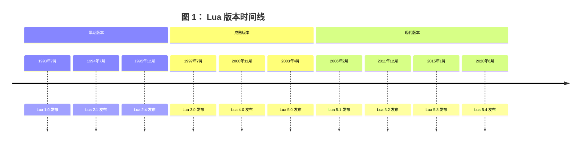

# The Evolution of Lua

| Roberto Ierusalimschy                                           | Luiz Henrique de Figueiredo                                    | Waldemar Celes                                                  |
| --------------------------------------------------------------- | -------------------------------------------------------------- | --------------------------------------------------------------- |
| Department of Computer Science, PUC-Rio, Rio de Janeiro, Brazil | IMPA–Instituto Nacional de Matem´atica Pura e Aplicada, Brazil | Department of Computer Science, PUC-Rio, Rio de Janeiro, Brazil |
| [roberto@inf.puc-rio.br]                                        | [lhf@impa.br]                                                  | [celes@inf.puc-rio.br]                                          |

## Abstract

我们报告了 Lua 语言的诞生和演变，并讨论了它如何从一个简单的配置语言发展成为一种多功能、广泛使用的语言，支持可扩展的语义、匿名函数、完整的词法作用域、适当的尾调用以及协程。

分类与主题描述符 K.2 [计算机历史]: 软件；D.3 [编程语言]

## 1. Introduction

Lua 是一种脚本语言，于 1993 年诞生于巴西里约热内卢的天主教大学（PUC-Rio）。自那时起，Lua 不断发展，现已被广泛应用于各种工业领域，如机器人技术、文学编程、分布式业务、图像处理、可扩展文本编辑器、以太网交换机、生物信息学、有限元分析软件包、网络开发等 [^2]。特别是在游戏开发领域，Lua 已成为领先的脚本语言之一。

Lua 的发展远远超出了我们最乐观的预期。事实上，尽管几乎所有的编程语言都源自北美和西欧（除了来自日本的 Ruby 这一显著例外）[^4]，Lua 是唯一一个在发展中国家创建并取得全球影响力的语言。

从一开始，Lua 就被设计为简单、小巧、可移植、快速且易于嵌入应用程序中。这些设计原则至今仍然有效，我们相信它们正是 Lua 在工业领域取得成功的原因。Lua 的主要特点及其简洁性的生动体现，在于它提供了一种单一的数据结构 —— 表（table），这是 Lua 对关联数组的称呼 [^9]。尽管大多数脚本语言都提供关联数组，但在其他语言中，关联数组并未扮演如此核心的角色。Lua 的表为模块、基于原型的对象、基于类的对象、记录、数组、集合、包、列表以及许多其他数据结构提供了简单而高效的实现 [^28]。

在本文中，我们报告了 Lua 的诞生与演变。我们探讨了 Lua 如何从一个简单的配置语言发展成为一种强大（但仍保持简洁）的语言，支持可扩展的语义、匿名函数、完整的词法作用域、适当的尾调用以及协程。在 §2 中，我们概述了 Lua 的主要概念，这些概念将在其他章节中用于讨论 Lua 的演变过程。在 §3 中，我们回顾了 Lua 的 “史前史”，即导致其诞生的背景。在 §4 中，我们讲述了 Lua 的诞生过程、其最初的设计目标以及第一个版本的功能。 §5 讨论了 Lua 如何以及为何演变，而 §6 则对部分特性的演变进行了详细探讨。本文在 §7 中以对 Lua 演变的回顾作为结尾，并在 §8 中简要讨论了 Lua 成功的原因，尤其是在游戏领域中的成功。

## 2. Overview

在本节中，我们简要概述了 Lua 语言，并介绍了在 §5 和 §6 中讨论的概念。关于 Lua 的完整定义，请参阅其参考手册 [^32]。如需详细了解 Lua，请参阅 Roberto 的书籍 [^28]。为了具体化，我们将描述 Lua 5.1，这是本文撰写时（2007 年 4 月）的最新版本，但本节的大部分内容同样适用于之前的版本。

从语法上看，Lua 与 Modula 相似，并使用常见的关键字。为了展示 Lua 的语法，以下代码展示了两种实现阶乘函数的方式，一种是递归实现，另一种是迭代实现。任何具备基本编程知识的人可能无需解释就能理解这些示例。

```lua
-- 递归实现
function factorial (n)
    if n == 0 then
        return 1
    else
        return n * factorial (n - 1)
    end
end

-- 迭代实现
function factorial (n)
    local result = 1
    for i = 2, n do
        result = result * i
    end
    return result
end
```

从语义上看，Lua 与 Scheme 有许多相似之处，尽管这些相似性并不显而易见，因为两种语言在语法上差异很大。在 Lua 的演变过程中，Scheme 对其影响逐渐增强：最初，Scheme 只是背景中的一种语言，但后来它逐渐成为重要的灵感来源，尤其是在引入匿名函数和完整的词法作用域之后。

与 Scheme 类似，Lua 是动态类型的：变量没有类型，只有值有类型。与 Scheme 一样，Lua 中的变量从不包含结构化值，而只是对它们的引用。与 Scheme 一样，函数名在 Lua 中没有特殊地位：它只是一个普通的变量，恰好引用了一个函数值。实际上，上面使用的函数定义语法 `function foo ()・・・end` 只是将匿名函数赋值给变量的语法糖：`foo = function ()・・・end`。与 Scheme 一样，Lua 具有词法作用域的一等函数。实际上，Lua 中的所有值都是一等值：它们可以赋值给全局变量和局部变量，存储在表中，作为参数传递给函数，并从函数中返回。

Lua 与 Scheme 之间的一个重要语义差异 —— 可能也是 Lua 的主要区别特征 —— 是 Lua 将表（table）作为其唯一的数据结构机制。Lua 的表是关联数组 [^9]，但具有一些重要特性。与 Lua 中的所有值一样，表是一等值：它们不像 Awk 和 Perl 中那样绑定到特定的变量名。表可以使用任何值作为键，并可以存储任何值。表通过使用字段名作为键，可以简单高效地实现记录；通过使用集合元素作为键，可以实现集合；还可以实现通用链表结构以及许多其他数据结构。此外，我们可以通过使用自然数作为索引，用表来实现数组。精心设计的实现 [^31] 确保这样的表与数组占用相同的内存（因为它在内部表示为实际的数组），并且在独立基准测试中表现优于类似语言中的数组 [^1]。

Lua 提供了一种表达力丰富的语法来创建表，即构造函数。最简单的构造函数是表达式 {}，它会创建一个新的空表。还有一些构造函数用于创建列表（或数组），例如：`{"Sun","Mon","Tue","Wed","Thu","Fri","Sat"}` 以及用于创建记录，例如：`{lat= -22.90, long= -43.23, city="Rio de Janeiro"}`。这两种形式可以自由混合使用。表使用方括号进行索引，例如 `t [2]`，而 `t.x` 则是 `t ["x"]` 的语法糖。

表构造函数与函数的结合使 Lua 成为一种强大的通用过程式数据描述语言。例如，一个类似于 BibTEX [^34] 格式的文献数据库可以写成一系列表构造函数，如下所示：

```lua
article {"spe96"
    authors = {
        "Roberto Ierusalimschy",
        "Luiz Henrique de Figueiredo",
        "Waldemar Celes" },
    title = "Lua: an Extensible Extension Language",
    journal = "Software: Practics & Experience",
    year = 1996
}
```

尽管这样的数据库看起来是一个静态的数据文件，但它实际上是一个有效的 Lua 程序：当数据库被加载到 Lua 中时，其中的每一项都会调用一个函数，因为 `article {・・・}` 是 `article ({・・・})` 的语法糖，即一个以表为唯一参数的函数调用。正是在这个意义上，这类文件被称为过程式数据文件（procedural data files）。

我们说 Lua 是一种可扩展的扩展语言 [^30]。它是一种扩展语言，因为它通过配置、宏和其他终端用户定制来帮助扩展应用程序。Lua 被设计为嵌入到宿主应用程序中，以便用户可以通过编写 Lua 程序来控制应用程序的行为，这些程序可以访问应用程序服务并操作应用程序数据。它是可扩展的，因为它提供了用户数据（userdata）值来保存应用程序数据，并提供了可扩展的语义机制以自然的方式操作这些值。Lua 作为一个小的核心提供，可以通过用 Lua 和 C 编写的用户函数进行扩展。特别是，输入输出、字符串操作、数学函数和操作系统接口都作为外部库提供。

Lua 的其他显著特征来自其实现：

**可移植性：** Lua 易于构建，因为它是用严格的 ANSI C 实现的。它在大多数平台（如 Linux、Unix、Windows、Mac OS X 等）上可以开箱即用，并且在我们所知的所有平台上（包括移动设备，如手持计算机和手机，以及嵌入式微处理器，如 ARM 和 Rabbit）只需进行少量调整即可运行。为了确保可移植性，我们努力在尽可能多的编译器下实现无警告编译。

**易于嵌入：** Lua 的设计目标是易于嵌入到应用程序中。Lua 的一个重要部分是一个定义良好的应用程序编程接口（API），它允许 Lua 代码与外部代码之间进行完全通信。特别是，通过从宿主应用程序导出 C 函数来扩展 Lua 非常容易。该 API 不仅允许 Lua 与 C 和 C++ 接口，还可以与其他语言（如 Fortran、Java、Smalltalk、Ada、C#（.Net））甚至其他脚本语言（如 Perl 和 Ruby）进行交互。

**小巧的体积：** 将 Lua 添加到应用程序中不会使其变得臃肿。整个 Lua 发行版，包括源代码、文档和一些平台的二进制文件，始终可以轻松地存放在一张软盘上。Lua 5.1 的压缩包（包含源代码、文档和示例）压缩后为 208K，解压后为 835K。源代码包含约 17,000 行 C 代码。在 Linux 下，使用所有标准 Lua 库构建的 Lua 解释器大小为 143K。大多数其他脚本语言的相应数字要大一个数量级以上，部分原因是 Lua 主要设计为嵌入应用程序中，因此其官方发行版仅包含少量库。而其他脚本语言则设计为独立使用，并包含许多库。

**高效性：** 独立基准测试 [^1] 显示，Lua 是解释型脚本语言领域中最快的语言之一。这使得应用程序开发者可以用 Lua 编写整个应用程序的相当大一部分。例如，Adobe Lightroom 中有超过 40% 的代码是用 Lua 编写的（约 10 万行 Lua 代码）。

尽管这些是特定实现的特点，但它们之所以可能，完全归功于 Lua 的设计。特别是，Lua 的简洁性是实现小巧高效的关键因素 [^31]。

## 3. Prehistory

Lua 于 1993 年诞生于巴西里约热内卢天主教大学（PUC-Rio）的计算机图形技术组（Tecgraf）。Lua 的创造者是 Roberto Ierusalimschy、Luiz Henrique de Figueiredo 和 Waldemar Celes。Roberto 当时是 PUC-Rio 计算机科学系的助理教授，Luiz Henrique 是博士后研究员，先在 IMPA（巴西纯数学与应用数学研究所）工作，后来加入 Tecgraf，而 Waldemar 是 PUC-Rio 计算机科学系的博士生。他们三人都是 Tecgraf 的成员，在共同开发 Lua 之前，分别参与不同的项目。他们的背景不同但相关：Roberto 是一位主要对编程语言感兴趣的计算机科学家；Luiz Henrique 是一位对软件工具和计算机图形学感兴趣的数学家；Waldemar 则是一位对计算机图形学应用感兴趣的工程师。（2001 年，Waldemar 加入 Roberto 成为 PUC-Rio 的教职员工，而 Luiz Henrique 则成为 IMPA 的研究员。）

Tecgraf 是一个拥有多个工业合作伙伴的大型研发实验室。自 1987 年 5 月成立后的头十年里，Tecgraf 主要致力于构建基础软件工具，以满足其客户对交互式图形程序的需求。因此，Tecgraf 的早期产品包括图形终端、绘图仪和打印机的驱动程序、图形库以及图形界面工具包。从 1977 年到 1992 年，巴西出于民族主义情绪，认为巴西能够并且应该生产自己的硬件和软件，因此对计算机硬件和软件实施了严格的贸易壁垒政策（称为 “市场保留”）。在这种背景下，Tecgraf 的客户在政治和经济上都无法承担从国外购买定制软件的费用：根据市场保留规则，他们必须通过复杂的官僚程序证明巴西公司无法满足他们的需求。再加上巴西与其他研发中心自然的地理隔离，这些原因促使 Tecgraf 从头开始实现其所需的基础工具。

Tecgraf 最大的合作伙伴之一（至今仍是）是巴西石油公司 Petrobras。Tecgraf 的多个产品是为 Petrobras 的工程应用开发的交互式图形程序。到 1993 年，Tecgraf 已经为其中两个应用程序开发了小型语言：一个是数据输入应用程序，另一个是用于岩性剖面分析的可配置报告生成器。这两种语言分别称为 DEL 和 SOL，它们是 Lua 的前身。我们在此简要描述它们，以展示 Lua 的起源。

### 3.1 DEL

Petrobras 的工程师每天需要多次为数值模拟器准备输入数据文件。这一过程既枯燥又容易出错，因为模拟程序是遗留代码，需要严格格式化的输入文件 —— 通常是纯数字列，没有任何说明每个数字的含义，这种格式源自打孔卡时代。1992 年初，Petrobras 要求 Tecgraf 为这类数据输入创建至少十几个图形前端。数字将通过点击描述模拟的图表的相关部分进行交互式输入 —— 这对工程师来说比编辑数字列要容易得多且更有意义。模拟器所需格式的数据文件将自动生成。除了简化数据文件的创建，这些前端还提供了数据验证的机会，并可以从输入数据中计算派生量，从而减少用户需要输入的数据量，并提高整个过程的可靠性。

为了简化这些前端的开发，由 Luiz Henrique de Figueiredo 和 Luiz Cristovão Gomes Coelho 领导的团队决定以统一的方式编写所有前端，并因此设计了 DEL（“数据输入语言”），这是一种简单的声明式语言，用于描述每个数据输入任务 [^17]。DEL 是现在所谓的领域特定语言 [^43]，但在当时简称为小型语言 [^10]。

典型的 DEL 程序定义了多个 “实体”。每个实体可以有多个字段，这些字段都有名称和类型。为了实现数据验证，DEL 包含谓词语句，用于对实体的值施加限制。DEL 还包括指定数据输入和输出方式的语句。DEL 中的实体本质上就是传统编程语言中的结构体或记录。重要的区别在于 —— 这也是 DEL 适合数据输入问题的原因 —— 实体名称也出现在一个单独的图形元文件中，该文件包含相关的图表，工程师在此图表上进行数据输入。一个名为 ED（“entrada de dados” 的缩写，葡萄牙语中意为 “数据输入”）的交互式图形解释器被编写出来，用于解释 DEL 程序。Petrobras 要求的所有数据输入前端都被实现为在此单一图形应用程序下运行的 DEL 程序。

DEL 在 Tecgraf 的开发人员和 Petrobras 的用户中都取得了成功。在 Tecgraf，DEL 如最初预期的那样简化了前端的开发。在 Petrobras，DEL 允许用户根据他们的需求定制数据输入应用程序。很快，用户开始要求 DEL 具备更多功能，例如用于控制实体是否处于输入状态的布尔表达式，DEL 因此变得更加复杂。当用户开始要求控制流（如条件语句和循环）时，很明显 ED 需要一个真正的编程语言，而不是 DEL。

### 3.2 SOL

大约在 DEL 创建的同时，由 Roberto Ierusalimschy 和 Waldemar Celes 领导的团队开始开发 PGM，这是一个用于岩性剖面分析的可配置报告生成器，同样是为 Petrobras 开发的。PGM 生成的报告由多个列（称为 “轨道”）组成，并且具有高度可配置性：用户可以创建和定位轨道，并选择颜色、字体和标签；每个轨道可以有一个网格，网格也有其一系列选项（对数 / 线性、垂直和水平刻度等）；每条曲线都有自己的比例尺，在溢出情况下必须自动调整；等等。所有这些配置都需要由终端用户完成，通常是 Petrobras 在石油工厂和海上平台工作的地质学家和工程师。配置需要存储在文件中以便重复使用。团队决定，配置 PGM 的最佳方式是通过一种称为 SOL（Simple Object Language 的缩写）的专用描述语言。

由于 PGM 需要处理许多不同的对象，每个对象都有许多不同的属性，SOL 团队决定不将这些对象和属性固定在语言中。相反，SOL 允许类型声明，如下面的代码所示：

```SOL
type @track{ x:number, y:number=23, id=0 }
type @line{ t:@track=@track{x=8}, z:number* }
T = @track{ y=9, x=10, id="1992-34" }
L = @line{ t=@track{x=T.y, y=T.x}, z=[2,3,4] }
```

这段代码定义了两个类型：`track` 和 `line`，并创建了两个对象：一个轨道 `T` 和一条线 `L`。track 类型包含两个数值属性 `x` 和 `y`，以及一个无类型属性 `id`；属性 `y` 和 `id` 具有默认值。`line` 类型包含一个轨道 `t` 和一个数字列表 `z`。轨道 `t` 的默认值为 `x=8`、`y=23` 和 `id=0` 的轨道。SOL 的语法深受 BibTEX [^34] 和 UIL（一种用于描述 Motif 用户界面的语言）[^39] 的影响。

SOL 解释器的主要任务是读取报告描述，检查给定的对象和属性是否类型正确，然后将信息传递给主程序（PGM）。为了实现主程序和 SOL 解释器之间的通信，解释器被实现为一个 C 库，并与主程序链接。主程序可以通过该库中的 API 访问所有配置信息。特别是，主程序可以为每种类型注册一个回调函数，SOL 解释器会调用该函数来创建该类型的对象。

## 4. Birth

SOL 团队在 1993 年 3 月完成了 SOL 的初始实现，但他们从未交付它。PGM 很快需要支持过程式编程，以允许创建更复杂的布局，而 SOL 将不得不进行扩展。与此同时，如前所述，ED 用户要求 DEL 具备更多功能。ED 还需要进一步的描述性功能来编程其用户界面。大约在 1993 年年中，Roberto、Luiz Henrique 和 Waldemar 聚在一起讨论 DEL 和 SOL，并得出结论：这两种语言可以被一种更强大的单一语言取代，他们决定设计和实现这种语言。于是，Lua 团队诞生了；自那以后，团队一直未变。

根据 ED 和 PGM 的需求，我们决定需要一种真正的编程语言，具备赋值、控制结构、子程序等功能。该语言还应提供数据描述功能，例如 SOL 所提供的功能。此外，由于该语言的许多潜在用户并非专业程序员，语言应避免晦涩的语法和语义。新语言的实现应具有高度可移植性，因为 Tecgraf 的客户拥有多样化的计算机平台。最后，由于我们预计其他 Tecgraf 产品也需要嵌入脚本语言，新语言应遵循 SOL 的范例，并作为一个具有 C API 的库提供。

当时，我们可以选择采用现有的脚本语言，而不是创建一种新语言。1993 年，唯一真正的竞争者是 Tcl [^40]，它被明确设计为嵌入应用程序中。然而，Tcl 的语法不够直观，对数据描述的支持也不够完善，并且只能在 Unix 平台上运行。我们没有考虑 LISP 或 Scheme，因为它们的语法不够友好。Python 当时还处于起步阶段。在 Tecgraf 当时盛行的自由、自己动手的氛围中，尝试开发我们自己的脚本语言是很自然的。因此，我们开始着手开发一种新语言，希望它比现有语言更简单易用。我们最初的设计决策是：保持语言简单小巧，并保持实现简单且可移植。由于新语言部分灵感来自 SOL（葡萄牙语中的 “太阳”），Tecgraf 的一位朋友（Carlos Henrique Levy）建议将其命名为 “Lua”（葡萄牙语中的 “月亮”），于是 Lua 诞生了。（DEL 并未直接影响 Lua 作为一门语言的设计。DEL 对 Lua 诞生的主要影响在于让我们意识到，复杂应用程序的很大部分可以通过嵌入式脚本语言来实现。）

我们想要一种轻量级但功能完备的语言，并具备数据描述能力。因此，我们采用了 SOL 中用于记录和列表构造的语法（但不包括类型声明），并通过表（table）统一了它们的实现：记录使用字符串（字段名）作为索引；列表使用自然数作为索引。例如，像这样的赋值语句：

```SOL
T = @track{ y=9, x=10, id="1992-34" }
```

在 SOL 中有效的语法，在 Lua 中仍然有效，但含义不同：它创建了一个对象（即一个表），并包含给定的字段，然后调用函数 track 对这个表进行验证，或者为某些字段提供默认值。该表达式的最终值就是这个表。

除了其过程式数据描述结构外，Lua 并未引入新的概念：Lua 是为实际生产使用而创建的，而不是作为一种支持编程语言研究的学术语言。因此，我们只是简单借鉴了（甚至无意识地）我们在其他语言中见过或读过的内容。我们没有重新阅读旧论文来回忆现有语言的细节，而是从我们对其他语言的了解出发，并根据我们的喜好和需求进行了调整。

我们很快确定了一小组控制结构，其语法主要借鉴了 Modula（如 `while`、`if` 和 `repeat until`）。从 CLU 中我们借鉴了多重赋值和函数调用中的多重返回值。我们将多重返回值视为 Pascal 和 Modula 中使用的引用参数以及 Ada 中使用的输入输出参数的更简单替代方案；我们还希望避免使用显式指针（如 C 语言中的指针）。从 C++ 中我们借鉴了允许局部变量在需要时才声明的巧妙想法。从 SNOBOL 和 Awk 中我们借鉴了关联数组，并将其称为表（tables）；然而，在 Lua 中，表是对象，而不是像 Awk 中那样绑定到变量。

Lua 中为数不多（且相对较小）的创新之一是字符串连接的语法。自然的 `+` 运算符会引发歧义，因为我们希望在算术操作中自动将字符串强制转换为数字。因此，我们发明了 `..`（两个点）作为字符串连接的语法。

一个有争议的点是分号的使用。我们认为，对于有 Fortran 背景的工程师来说，要求使用分号可能会有些困惑，但不允许使用分号又会让有 C 或 Pascal 背景的工程师感到困惑。典型的委员会风格下，我们决定让分号成为可选项。

最初，Lua 有七种类型：数字（仅实现为实数）、字符串、表（tables）、nil、用户数据（指向 C 对象的指针）、Lua 函数和 C 函数。为了保持语言的简洁，我们最初没有包含布尔类型：与 Lisp 一样，nil 表示假，其他任何值表示真。在 13 年的持续演变中，Lua 类型的唯一变化是在 Lua 3.0（1997 年）中将 Lua 函数和 C 函数统一为单一的函数类型，以及在 Lua 5.0（2003 年）中引入布尔类型和线程类型（见 §6.1）。为了简单起见，我们选择使用动态类型而不是静态类型。对于需要类型检查的应用程序，我们提供了基本的反射功能，例如运行时类型信息和全局环境的遍历，作为内置函数（见 §6.11）。

到 1993 年 7 月，Waldemar 完成了 Lua 的第一个实现，这是由 Roberto 指导的课程项目。该实现遵循了如今成为极限编程核心的信条：“最简单的可能有效的方法”[^7]。词法分析器使用 lex 编写，解析器使用 yacc 编写，这是实现语言的经典 Unix 工具。解析器将 Lua 程序翻译为基于栈的虚拟机的指令，然后由一个简单的解释器执行。C API 使得向 Lua 添加新函数变得非常容易，因此第一个版本仅提供了一个包含五个内置函数（`next`、`nextvar`、`print`、`tonumber`、`type`）的小型库和三个小型外部库（输入输出、数学函数和字符串操作）。

尽管实现简单 —— 或者可能正是因为其简单 ——Lua 的表现超出了我们的预期。PGM 和 ED 都成功使用了 Lua（PGM 至今仍在使用；ED 被 EDG [^12] 取代，后者大部分是用 Lua 编写的）。Lua 在 Tecgraf 内部立即取得了成功，很快其他项目也开始使用它。1993 年 10 月，在第七届巴西软件工程研讨会上，我们简要报告了 Lua 在 Tecgraf 的初步使用情况 [^29]。

本文的其余部分将讲述我们在改进 Lua 过程中的历程。

## 5. History

图 1 展示了 Lua 各版本发布的时间线。可以看出，自 Lua 3.0 以来，版本之间的时间间隔逐渐增加。这反映了我们的认识：Lua 正在成为一个成熟的产品，为了其不断增长的社区利益，需要保持稳定性。然而，对稳定性的需求并未阻碍进步。自那时以来，Lua 4.0 和 Lua 5.0 等主要新版本已经发布。



版本之间的长时间间隔也反映了我们的发布模式。与其他开源项目不同，我们的 alpha 版本非常稳定，而 beta 版本基本上就是最终版本，除非发现未覆盖的 bug。这种发布模式被证明对 Lua 的稳定性非常有利。许多产品已经使用了 Lua 的 alpha 或 beta 版本，并且运行良好。然而，这种发布模式并没有给用户太多机会去尝试新版本；它也使我们无法及时获得对拟议更改的反馈。因此，在 Lua 5.0 的开发过程中，我们开始发布 “工作” 版本，这些版本只是 Lua 当前开发的快照。这一举措使我们的发布模式更接近开源社区的 “早发布，常发布” 口号。

在本节的剩余部分，我们将讨论 Lua 演变过程中的一些重要里程碑。关于几个具体特性的演变细节将在 §6 中详细说明。表 1 总结了这一演变过程，并包含了 Lua 代码规模的统计数据，我们现在简要讨论这些数据。

标准库的数量一直保持在较少的水平，因为我们预计大多数 Lua 函数将由宿主应用程序或第三方库提供。在 Lua 3.1 之前，唯一的标准库是用于输入输出、字符串操作、数学函数以及一个特殊的内置函数库，这些内置函数库不使用 C API，而是直接访问内部数据结构。从那时起，我们陆续添加了用于调试（Lua 3.2）、与操作系统接口（Lua 4.0）、表和协程（Lua 5.0）以及模块（Lua 5.1）的库。

|                                |  1.0  |  1.1  |  2.1  |  2.2  |  2.4  |  2.5  |  3.0  |  3.1  |  3.2  |  4.0  |  5.0  |  5.1  |
| ------------------------------ | :---: | :---: | :---: | :---: | :---: | :---: | :---: | :---: | :---: | :---: | :---: | :---: |
| constructors                   |   •   |   •   |   •   |   •   |   •   |   •   |   •   |   •   |   •   |   •   |   •   |   •   |
| garbage collection             |   •   |   •   |   •   |   •   |   •   |   •   |   •   |   •   |   •   |   •   |   •   |   •   |
| extensible semantics           |       |       |   •   |   •   |   •   |   •   |   •   |   •   |   •   |   •   |   •   |   •   |
| support for OOP                |       |       |   •   |   •   |   •   |   •   |   •   |   •   |   •   |   •   |   •   |   •   |
| long strings                   |       |       |       |   •   |   •   |   •   |   •   |   •   |   •   |   •   |   •   |   •   |
| debug API                      |       |       |       |   •   |   •   |   •   |   •   |   •   |   •   |   •   |   •   |   •   |
| external compiler              |       |       |       |       |   •   |   •   |   •   |   •   |   •   |   •   |   •   |   •   |
| vararg functions               |       |       |       |       |       |   •   |   •   |   •   |   •   |   •   |   •   |   •   |
| pattern matching               |       |       |       |       |       |   •   |   •   |   •   |   •   |   •   |   •   |   •   |
| conditional compilation        |       |       |       |       |       |       |   •   |   •   |   •   |       |       |       |
| anonymous functions, closures  |       |       |       |       |       |       |       |   •   |   •   |   •   |   •   |   •   |
| debug library                  |       |       |       |       |       |       |       |       |   •   |   •   |   •   |   •   |
| multi-state API                |       |       |       |       |       |       |       |       |       |   •   |   •   |   •   |
| for statement                  |       |       |       |       |       |       |       |       |       |   •   |   •   |   •   |
| long comments                  |       |       |       |       |       |       |       |       |       |       |   •   |   •   |
| full lexical scoping           |       |       |       |       |       |       |       |       |       |       |   •   |   •   |
| booleans                       |       |       |       |       |       |       |       |       |       |       |   •   |   •   |
| coroutines                     |       |       |       |       |       |       |       |       |       |       |   •   |   •   |
| incremental garbage collection |       |       |       |       |       |       |       |       |       |       |       |   •   |
| module system                  |       |       |       |       |       |       |       |       |       |       |       |   •   |

|                            |  1.0  |  1.1  |  2.1  |  2.2  |  2.4  |  2.5  |  3.0  |  3.1  |  3.2  |  4.0  |  5.0  |  5.1  |
| -------------------------- | :---: | :---: | :---: | :---: | :---: | :---: | :---: | :---: | :---: | :---: | :---: | :---: |
| libraries                  |   4   |   4   |   4   |   4   |   4   |   4   |   4   |   4   |   5   |   6   |   8   |   9   |
| built-in functions         |   5   |   7   |  11   |  11   |  13   |  14   |  25   |  27   |  35   |   0   |   0   |   0   |
| API functions              |  30   |  30   |  30   |  30   |  32   |  32   |  33   |  47   |  41   |  60   |  76   |  79   |
| vm type (stack × register) |   S   |   S   |   S   |   S   |   S   |   S   |   S   |   S   |   S   |   S   |   R   |   R   |
| vm instructions            |  64   |  65   |  69   |  67   |  67   |  68   |  69   |  128  |  64   |  49   |  35   |  38   |
| keywords                   |  16   |  16   |  16   |  16   |  16   |  16   |  16   |  16   |  16   |  18   |  21   |  21   |
| other tokens               |  21   |  21   |  23   |  23   |  23   |  23   |  24   |  25   |  25   |  25   |  24   |  26   |

<div align="center">表 1. Lua 功能的演变</div>

在 Lua 4.0 中，C API 经历了重大重新设计，其规模发生了显著变化。从那时起，C API 逐渐趋于完善。因此，Lua 不再有任何内置函数：所有标准库都基于 C API 实现，而无需访问 Lua 的内部结构。

执行 Lua 程序的虚拟机在 Lua 4.0 之前是基于栈的。在 Lua 3.1 中，我们为许多指令添加了变体，试图提高性能。然而，事实证明这过于复杂，且性能提升有限，因此在 Lua 3.2 中我们移除了这些变体。从 Lua 5.0 开始，虚拟机改为基于寄存器 [^31]。这一变化为代码生成器提供了更多优化机会，并减少了典型 Lua 程序的指令数量。（指令调度是虚拟机执行时间的重要组成部分 [^13]。）据我们所知，Lua 5.0 的虚拟机是第一个广泛使用的基于寄存器的虚拟机。

### 5.1 Lua 1

Lua 的初始实现在 Tecgraf 中取得了成功，并吸引了其他 Tecgraf 项目的用户。新用户带来了新的需求。一些用户希望将 Lua 用作图形元文件的支持语言，这在 Tecgraf 中非常普遍。与其他可编程元文件相比，Lua 元文件的优势在于它基于一种真正的过程式语言：通过将过程式代码片段与声明式语句结合，可以自然地建模复杂对象。相比之下，例如 VRML [^8] 必须使用另一种语言（Javascript）来建模过程式对象。

将 Lua 用于此类数据描述，尤其是大型图形元文件，提出了对典型脚本语言来说不常见的挑战。例如，在数据输入程序 ED 中使用的图表通常有数千个部分，这些部分由一个包含数千个项目的 Lua 表构造函数描述。这意味着 Lua 必须能够处理巨大的程序和巨大的表达式。由于 Lua 会即时将所有程序预编译为虚拟机的字节码，这也意味着 Lua 编译器必须运行得非常快，即使对于大型程序也是如此。

通过将第一版中使用的 lex 生成的扫描器替换为手写的扫描器，我们几乎将 Lua 编译器在典型元文件上的速度提高了一倍。我们还修改了 Lua 的虚拟机，使其能够通过批量添加键值对来处理长构造函数，而不是像原始虚拟机那样逐个添加。这些变化满足了最初对更好性能的需求。从那时起，我们一直致力于减少预编译所花费的时间。

1994 年 7 月，我们发布了包含这些优化的 Lua 新版本。该版本发布的同时，我们发表了第一篇描述 Lua 及其设计和实现的论文 [^15]。我们将新版本命名为 “Lua 1.1”。之前的版本从未公开发布，后来被命名为 “Lua 1.0”。（2003 年 10 月，为庆祝 Lua 诞生 10 周年，我们发布了 1993 年 7 月的 Lua 1.0 快照。）

Lua 1.1 在开源运动获得当前势头之前，作为源代码通过 ftp 公开发布。Lua 1.1 有一个限制性用户许可证：它可免费用于学术目的，但商业用途需要协商。许可证的这一部分并未奏效：尽管我们有一些初步接触，但从未协商过任何商业用途。这一事实以及其他脚本语言（例如 Tcl）的免费性质使我们意识到，对商业用途的限制甚至可能阻碍学术用途，因为一些学术项目计划最终进入市场。因此，在发布下一个版本（Lua 2.1）时，我们选择将其作为不受限制的自由软件发布。天真地，我们通过略微拼贴和重写现有许可证，编写了自己的许可证文本。我们认为新的许可证非常宽松是显而易见的。然而，后来随着开源许可证的普及，我们的许可证文本在一些用户中引起了争议；特别是，尚不清楚我们的许可证是否与 GPL 兼容。2002 年 5 月，经过邮件列表中的长时间讨论，我们决定在众所周知的、非常宽松的 MIT 许可证 [^3] 下发布 Lua 的未来版本（从 Lua 5.0 开始）。2002 年 7 月，自由软件基金会确认我们之前的许可证与 GPL 兼容，但我们已经承诺采用 MIT 许可证。从那时起，关于我们许可证的问题几乎消失了。

### 5.2 Lua 2

尽管面向对象编程（在 20 世纪 90 年代初达到顶峰）及其相关的用户压力要求 Lua 添加面向对象特性，但我们并不希望将 Lua 变成一种面向对象的语言，因为我们不想为 Lua 固定一种编程范式。特别是，我们认为 Lua 不需要将对象和类作为原始语言概念，尤其是因为它们可以通过表来实现（如果需要的话，表可以同时保存对象数据和方法，因为函数是一等值）。尽管用户压力不断，我们至今仍未改变主意：Lua 不会强制程序员使用任何对象或类模型。用户已经提出并实现了多种对象模型；这是我们邮件列表中经常讨论的话题。我们认为这是健康的。

另一方面，我们希望允许使用 Lua 进行面向对象编程。我们没有固定一种模型，而是决定提供灵活的机制，使程序员能够构建适合应用程序的任何模型。1995 年 2 月发布的 Lua 2.1 标志着这些可扩展语义机制的引入，这些机制大大提高了 Lua 的表现力。可扩展语义已成为 Lua 的标志之一。

可扩展语义的目标之一是允许表用作对象和类的基础。为此，我们需要为表实现继承。另一个目标是将用户数据（userdata）变成应用程序数据的自然代理，而不仅仅是作为函数参数使用的句柄。我们希望能够像索引表一样索引用户数据，并在它们上调用方法。这将使 Lua 更自然地实现其主要设计目标之一：通过提供对应用程序服务和数据的可脚本化访问来扩展应用程序。我们没有直接在语言中添加支持所有这些特性的机制，而是决定在概念上更简单地定义一个更通用的后备机制，让程序员在 Lua 不知道如何继续时进行干预。

我们在 Lua 2.1 中引入了后备机制（fallbacks），并为以下操作定义了它们：表索引、算术操作、字符串连接、顺序比较和函数调用。当这些操作应用于 “错误” 类型的值时，会调用相应的后备机制，允许程序员决定 Lua 如何继续执行。表索引后备机制允许用户数据（userdata）和其他值表现得像表一样，这是我们的动机之一。我们还定义了一个后备机制，当表中缺少某个键时调用它，以便支持多种形式的继承（通过委托）。为了完善对面向对象编程的支持，我们添加了两项语法糖：方法定义 `function a:foo (・・・)` 作为 `function a.foo (self,・・・)` 的简写，以及方法调用 `a:foo (・・・)` 作为 `a.foo (a,・・・)` 的简写。在 §6.8 中，我们将详细讨论后备机制及其演变为后续版本中的标签方法（tag methods）和元方法（metamethods）的过程。

自 Lua 1.0 以来，我们为值提供了内省函数：type，用于查询 Lua 值的类型；next，用于遍历表；以及 nextvar，用于遍历全局环境。（如 §4 所述，这部分是为了实现类似 SOL 的类型检查。）为了响应用户对完整调试功能的需求，Lua 2.2（1995 年 11 月）引入了调试 API，以提供有关运行函数的信息。该 API 为用户提供了用 C 语言编写自己的内省工具（如调试器和性能分析器）的手段。调试 API 最初非常简单：它允许访问 Lua 调用堆栈、当前执行的行，并提供了一个函数来查找持有给定值的变量名称。在 Tomás Gorham 的硕士工作 [^22] 之后，Lua 2.4（1996 年 5 月）通过添加访问局部变量的函数以及在行更改和函数调用时调用的钩子，改进了调试 API。

随着 Lua 在 Tecgraf 的广泛使用，许多大型图形元文件被用 Lua 编写为图形编辑器的输出。随着这些元文件变得更大、更复杂，加载它们所需的时间也越来越长。自 Lua 的第一个版本以来，Lua 在运行程序之前会将所有程序预编译为字节码。通过将字节码保存到文件中，可以大幅减少大型程序的加载时间。这对于图形元文件等过程式数据文件尤其重要。因此，在 Lua 2.4 中，我们引入了一个外部编译器 luac，它预编译 Lua 程序并将生成的字节码保存到二进制文件中。（我们关于 Lua 的第一篇论文 [^15] 已经预见了外部编译器的可能性。）该文件的格式被设计为易于加载且具有合理的可移植性。通过 luac，程序员可以避免在运行时进行解析和代码生成，这在早期是非常耗时的。除了更快的加载速度，luac 还允许离线语法检查并防止用户随意更改。许多产品（例如《模拟人生》和 Adobe Lightroom）以预编译形式分发 Lua 脚本。

在实现 luac 的过程中，我们开始将 Lua 的核心重构为清晰分离的模块。因此，现在可以很容易地移除解析模块（词法分析器、解析器和代码生成器），这些模块目前占核心代码的 35%，只留下加载预编译 Lua 程序的模块，该模块仅占核心代码的 3%。当将 Lua 嵌入到移动设备、机器人和传感器等小型设备中时，这种缩减可能非常重要。

自 Lua 的第一个版本以来，Lua 就包含了一个用于字符串处理的库。在 Lua 2.4 之前，该库提供的功能非常有限。然而，随着 Lua 的成熟，人们希望在 Lua 中进行更重的文本处理。我们认为，按照 Snobol、Icon、Awk 和 Perl 的传统，模式匹配是 Lua 的一个自然补充。然而，我们不想在 Lua 中包含第三方的模式匹配引擎，因为这类引擎往往非常庞大；我们也希望避免因在 Lua 中包含第三方代码而可能引发的版权问题。

作为 1995 年第二学期由 Roberto 指导的学生项目，Milton Jonathan、Pedro Miller Rabinovitch、Pedro Willemsens 和 Vinicius Almendra 为 Lua 开发了一个模式匹配库。基于该设计的经验，我们为 Lua 编写了自己的模式匹配引擎，并在 Lua 2.5（1996 年 11 月）中将其添加到两个函数中：strfind（最初只能查找纯子字符串）和新的 gsub 函数（名称取自 Awk）。gsub 函数全局替换较大字符串中与给定模式匹配的子字符串。它接受替换字符串或一个函数，该函数在每次找到匹配时被调用，并返回该匹配的替换字符串。（这在当时是一项创新。）为了实现小型实现，我们没有包含完整的正则表达式。相反，我们的引擎理解的模式基于字符类、重复和捕获（但不包括交替或分组）。尽管简单，这种模式匹配功能非常强大，是 Lua 的一个重要补充。

那一年是 Lua 历史上的一个转折点，因为它获得了国际曝光。1996 年 6 月，我们在《Software: Practice & Experience》上发表了一篇关于 Lua 的论文 [^30]，这使 Lua 引起了外界的关注，至少在学术界是如此。1996 年 12 月，就在 Lua 2.5 发布后不久，《Dr. Dobb’s Journal》杂志刊登了一篇关于 Lua 的文章 [^16]。《Dr. Dobb’s Journal》是一本直接面向程序员的流行出版物，那篇文章使 Lua 引起了软件行业的注意。在那篇文章发表后不久，我们收到了许多消息，其中一条是 1997 年 1 月由 Bret Mogilefsky 发送的，他是当时 LucasArts 正在开发的冒险游戏《Grim Fandango》的首席程序员。Bret 告诉我们，他在《Dr. Dobb’s》上读到了 Lua，并计划用 Lua 替换他们自制的脚本语言。《Grim Fandango》于 1998 年 10 月发布，1999 年 5 月，Bret 告诉我们 “游戏中很大一部分是用 Lua 编写的”（他的强调）[^38]。大约在那时，Bret 参加了游戏开发者大会（GDC，游戏程序员的主要活动）上关于游戏脚本的圆桌讨论，并在结束时分享了他在《Grim Fandango》中成功使用 Lua 的经验。我们知道有几个开发者是在那次活动中第一次了解到 Lua 的。之后，Lua 通过口碑在游戏开发者中传播，成为游戏行业中一项明确的市场技能（见 §8）。

由于 Lua 的国际曝光，向我们发送的关于 Lua 的问题消息数量大幅增加。为了更高效地处理这些流量，并开始构建 Lua 社区，以便其他人可以回答 Lua 问题，我们在 1997 年 2 月创建了一个讨论 Lua 的邮件列表。自那时以来，该列表已发布了超过 38,000 条消息。Lua 在许多流行游戏中的使用吸引了许多人加入该列表，现在该列表有超过 1200 名订阅者。我们很幸运，Lua 列表非常友好，同时非常技术化。该列表已成为 Lua 社区的中心，并成为改进 Lua 的动力来源。所有重要事件都首先在邮件列表中发生：发布公告、功能请求、错误报告等。

在这些年中，邮件列表两次讨论了创建 comp.lang.lua Usenet 新闻组的问题，分别是在 1998 年 4 月和 1999 年 7 月。两次的结论都是列表的流量不足以证明创建新闻组的必要性。此外，大多数人更喜欢邮件列表。创建新闻组似乎不再相关，因为现在有多个网络界面可以阅读和搜索完整的列表存档。

### 5.3 Lua 3

Lua 2.1 中引入的后备机制（fallback）用于支持可扩展语义，效果很好，但它是一个全局机制：每个事件只有一个钩子。这使得代码共享或重用变得困难，因为为同一事件定义后备机制的模块无法轻松共存。1996 年 12 月，根据 Stephan Herrmann 的建议，我们在 Lua 3.0（1997 年 7 月）中通过用标签方法（tag methods）替换后备机制解决了冲突问题：钩子被附加到（事件，标签）对，而不仅仅是事件。标签在 Lua 2.1 中作为整数标签引入，可以附加到用户数据（userdata）上（见 §6.10）；其意图是相同类型的 C 对象在 Lua 中由具有相同标签的用户数据表示。（然而，Lua 并未强制对标签进行任何解释。）在 Lua 3.0 中，我们将标签扩展到所有值以支持标签方法。后备机制的演变在 §6.8 中讨论。

Lua 3.1（1998 年 7 月）通过引入匿名函数和通过 “上值”（upvalues）实现的函数闭包，将函数式编程带入了 Lua。（完整的词法作用域直到 Lua 5.0 才实现；见 §6.6。）闭包的引入主要是由于高阶函数（如 gsub）的存在，这些函数将函数作为参数。在 Lua 3.1 的开发过程中，邮件列表中讨论了多线程和协作式多任务处理，主要是由于 Bret Mogilefsky 为《Grim Fandango》对 Lua 2.5 和 3.1 alpha 所做的更改。虽然没有得出结论，但该主题仍然很受欢迎。协作式多任务处理最终在 Lua 5.0（2003 年 4 月）中提供；见 §6.7。

从 Lua 1.0 到 Lua 3.2，C API 基本保持不变；它在一个隐式的 Lua 状态上工作。然而，较新的应用程序（如 Web 服务）需要多个状态。为了缓解这个问题，Lua 3.1 引入了可以在运行时切换的多个独立 Lua 状态。完全可重入的 API 必须等到 Lua 4.0。在此期间，出现了两个带有显式 Lua 状态的 Lua 3.2 非官方版本：一个是由 Roberto Ierusalimschy 和 Anna Hester 于 1998 年基于 Lua 3.2 alpha 为 CGILua [^26] 编写的，另一个是由 Erik Hougaard 于 1999 年基于 Lua 3.2 最终版编写的。Erik 的版本是公开可用的，并被用于 Crazy Ivan 机器人。CGILua 的版本仅作为 CGILua 发行版的一部分发布；它从未作为独立包存在。

Lua 3.2（1999 年 7 月）本身主要是一个维护版本；除了允许用 Lua 而不是 C 编写工具的调试库外，没有引入新功能。尽管如此，Lua 当时已经相当稳定，Lua 3.2 有着很长的生命周期。由于下一个版本（Lua 4.0）引入了新的、不兼容的 API，许多用户选择停留在 Lua 3.2，从未迁移到 Lua 4.0。例如，Tecgraf 从未迁移到 Lua 4.0，而是选择直接迁移到 Lua 5.0；Tecgraf 的许多产品仍在使用 Lua 3.2。

### 5.4 Lua 4

Lua 4.0 于 2000 年 11 月发布。如上所述，Lua 4.0 的主要变化是完全可重入的 API，这是由需要多个 Lua 状态的应用程序推动的。由于使 API 完全可重入已经是一个重大变化，我们借此机会围绕与 C 交换值的清晰栈模型重新设计了 API（见 §6.9）。这是 Reuben Thomas 于 2000 年 7 月首次提出的建议。

Lua 4.0 还引入了 for 语句，这是当时大多数 Lua 用户愿望清单中的首要项目，也是邮件列表中经常讨论的话题。我们之前没有包含 for 语句，因为 while 循环更通用。然而，用户抱怨说他们总是忘记在 while 循环结束时更新控制变量，从而导致无限循环。此外，我们无法就一个好的语法达成一致。我们认为 Modula 的 for 过于限制，因为它不涵盖对表元素或文件行的迭代。C 风格的 for 循环与 Lua 的其他部分不匹配。随着 Lua 3.1 中闭包和匿名函数的引入，我们决定使用高阶函数来实现迭代。因此，Lua 3.1 提供了一个高阶函数，通过调用用户提供的函数来遍历表中的所有键值对。要打印表 t 中的所有键值对，只需说 foreach (t,print)。

在 Lua 4.0 中，我们最终设计了一个 for 循环，分为两种变体：数字循环和表遍历循环（由 Michael Spalinski 于 1997 年 10 月首次提出）。这两种变体涵盖了大多数常见的循环；对于真正通用的循环，仍然有 while 循环。打印表 t 中的所有键值对可以如下完成：

```lua
for k,v in t do
    print(k,v)
end
```

添加 for 语句虽然简单，但它确实改变了 Lua 程序的外观。特别是，Roberto 不得不重写他关于 Lua 编程的书籍草稿中的许多示例。Roberto 自 1998 年以来一直在编写这本书，但由于 Lua 是一个不断变化的目标，他始终无法完成它。随着 Lua 4.0 的发布，书中的大部分内容以及几乎所有的代码片段都必须重写。

在 Lua 4.0 发布后不久，我们开始着手开发 Lua 4.1。Lua 4.1 面临的主要问题可能是是否以及如何支持多线程，这是当时的一个重大问题。随着 Java 和 Pthreads 的日益普及，许多程序员开始认为支持多线程是任何编程语言的基本特性。然而，对我们来说，在 Lua 中支持多线程带来了严重的问题。首先，在 C 中实现多线程需要 ANSI C 中没有的原语——尽管 Pthreads 很流行，但有许多平台（现在仍然如此）没有这个库。其次，也是更重要的，我们不相信标准的多线程模型，即带有共享内存的抢占式并发：我们仍然认为，在一种语言中，如果 a=a+1 不是确定性的，那么没有人能编写出正确的程序。

对于 Lua 4.1，我们尝试以典型的 Lua 方式解决这些困难：我们只实现了一个称为线程（threads）的多栈基本机制。外部库可以使用这些 Lua 线程，基于 Pthreads 等支持库来实现多线程。同样的机制也可以用于实现协程，即非抢占式的协作多线程。Lua 4.1 alpha 于 2001 年 7 月发布，支持外部多线程和协程；它还引入了对弱表的支持，并采用了基于寄存器的虚拟机，我们想对此进行实验。

Lua 4.1 alpha 发布的第二天，John D. Ramsdell 在邮件列表中发起了一场关于词法作用域的大讨论。经过几十条消息的讨论，很明显 Lua 需要完整的词法作用域，而不是自 Lua 3.1 以来采用的 upvalue 机制。到 2001 年 10 月，我们提出了一个高效的完整词法作用域实现，并于 2001 年 11 月作为工作版本发布。（关于词法作用域的详细讨论见 §6.6。）该版本还引入了一种新的混合表表示法，使其在适当的情况下可以作为数组实现（详见 §6.2）。由于该版本实现了新的基本算法，我们决定将其作为工作版本发布，尽管我们已经发布了 Lua 4.1 的 alpha 版本。

2002 年 2 月，我们发布了 Lua 4.1 的新工作版本，其中包含三个重要的新特性：基于迭代器函数的通用 for 循环、元表和元方法（用于替换标签和后备机制，见 §6.8）以及协程（见 §6.7）。在该版本发布后，我们意识到 Lua 4.1 将带来太多重大变化——也许“Lua 5.0”是下一个版本的更好名称。

### 5.5 Lua 5

对 “Lua 4.1” 这个名字的最后一击发生在几天后，在 Christian Lindig 和 Norman Ramsey 在哈佛组织的 Lua 库设计研讨会期间。研讨会的主要结论之一是 Lua 需要某种模块系统。尽管我们一直认为模块可以使用表来实现，但即使是标准的 Lua 库也没有遵循这一路径。于是，我们决定在下一个版本中迈出这一步。

将库函数封装在表中产生了很大的实际影响，因为它影响了任何至少使用一个库函数的程序。例如，旧的 `strfind` 函数现在被称为 `string.find`（存储在 string 表中的字符串库的 find 字段）；`openfile` 变成了 `io.open`；`sin` 变成了 `math.sin`；等等。为了使过渡更容易，我们提供了一个兼容性脚本，用新函数定义旧函数：

```lua
strfind = string.find
openfile = io.open
sin = math.sin
```

然而，将库封装在表中是一个重大变化。2002 年 6 月，当我们发布了包含这一变化的下一个工作版本时，我们放弃了 “Lua 4.1” 这个名字，并将其命名为 “Lua 5.0 work0”。从那时起，最终版本的进展稳步推进，Lua 5.0 于 2003 年 4 月发布。这次发布使 Lua 足够稳定，Roberto 得以完成他的书，该书于 2003 年 12 月出版 [^27]。

在 Lua 5.0 发布后不久，我们开始着手开发 Lua 5.1。最初的动机是实现增量垃圾回收，以响应游戏开发者的请求。Lua 使用传统的标记 - 清除垃圾回收器，在 Lua 5.0 之前，垃圾回收是原子性执行的。因此，某些应用程序在垃圾回收期间可能会经历潜在的长暂停。当时，我们主要担心的是，添加实现增量垃圾回收器所需的写屏障会对 Lua 的性能产生负面影响。为了弥补这一点，我们尝试使回收器也成为分代式的。我们还希望保留旧回收器的自适应行为，即根据使用的总内存调整回收周期的频率。此外，我们希望像 Lua 的其他部分一样，保持回收器的简单性。

我们为增量分代垃圾回收器工作了一年多。但由于我们无法访问具有高内存需求的应用程序（如游戏），因此很难在实际场景中测试回收器。从 2004 年 3 月到 12 月，我们发布了多个工作版本，试图获得关于回收器在实际应用中性能的具体反馈。我们最终收到了一些关于奇怪内存分配行为的报告，后来我们设法重现了这些问题，但无法解释。2005 年 1 月，Lua 社区的活跃成员 Mike Pall 提出了内存分配图，解释了这个问题：在某些场景中，增量行为、分代行为和自适应行为之间存在微妙的相互作用，导致回收器 “适应” 越来越少的回收频率。由于它变得过于复杂和不可预测，我们放弃了分代方面，在 Lua 5.1 中实现了一个更简单的增量回收器。

在此期间，程序员们一直在试验 Lua 5.0 中引入的模块系统。新的包开始被制作出来，旧的包也迁移到了新系统。包作者们想知道构建模块的最佳方式。2005 年 7 月，在 Lua 5.1 的开发过程中，Mark Hamburg 在 Adobe 圣何塞组织了一次国际 Lua 研讨会。（2006 年 9 月，Wim Couwenberg 和 Daniel Silverstone 在 Oc´e Venlo 组织了类似的研讨会。）其中一个演示是关于 Lua 5.1 的新特性，并进行了关于模块和包的长时间讨论。结果，我们对模块系统进行了一些小而重要的更改。尽管我们对 Lua 的指导方针是 “机制，而不是策略”，但我们定义了一组编写模块和加载包的策略，并进行了小的更改以更好地支持这些策略。Lua 5.1 于 2006 年 2 月发布。尽管 Lua 5.1 的最初动机是增量垃圾回收，但模块系统的改进可能是最明显的变化。另一方面，增量垃圾回收仍然不可见，表明它成功地避免了长暂停。

## 6. Feature evolution

在本节中，我们将详细讨论 Lua 某些特性的演变。

### 6.1 Types

Lua 中的类型一直相当稳定。长期以来，Lua 只有六种基本类型：nil、number、string、table、function 和 userdata。（实际上，在 Lua 3.0 之前，C 函数和 Lua 函数在内部有不同的类型，但这种差异对调用者是透明的。）唯一真正的变化发生在 Lua 5.0 中，它引入了两种新类型：thread 和 boolean。

thread 类型被引入以表示协程。与所有其他 Lua 值一样，线程是一等值。为了避免创建新的语法，线程上的所有基本操作都由库提供。

长期以来，我们一直抵制在 Lua 中引入布尔值：nil 是假，其他任何值都是真。这种状态很简单，似乎足以满足我们的需求。然而，nil 也被用于表中缺失的字段和未定义的变量。在某些应用程序中，允许表字段被标记为假但仍然被视为存在是很重要的；可以使用显式的 false 值来实现这一点。在 Lua 5.0 中，我们最终引入了布尔值 true 和 false。nil 仍然被视为假。事后看来，如果 nil 在布尔表达式中引发错误，就像在其他表达式中一样，可能会更好。这将更符合其作为未定义值代理的角色。然而，这样的更改可能会破坏许多现有程序。LISP 也有类似的问题，空列表既表示 nil 又表示 false。Scheme 明确表示 false 并将空列表视为 true，但一些 Scheme 的实现仍然将空列表视为 false。

### 6.2 Tables

Lua 1.1 中有三种语法结构来创建表：`@()`、`@[]` 和 `@{}`。最简单的形式是 `@()`，它创建一个空表。可以在创建时提供一个可选的大小作为效率提示。`@[]` 形式用于创建数组，例如 `@[2,4,9,16,25]`。在这样的表中，键是从 1 开始的隐式自然数。`@{}` 形式用于创建记录，例如 `@{name="John",age=35}`。这样的表是键值对的集合，其中键是显式字符串。使用这些形式创建的表在创建后可以动态修改，无论它是如何创建的。此外，在创建列表和记录时可以提供用户函数，例如 `@foo[]` 或 `@foo{}`。这种语法继承自 SOL，是过程式数据描述的体现，这是 Lua 的一个主要特性（见 §2）。语义是创建一个表，然后以该表作为唯一参数调用函数。函数可以随意检查和修改表，但其返回值被忽略：表是表达式的最终值。

在 Lua 2.1 中，表创建的语法被统一和简化：去掉了开头的 `@`，唯一的构造函数变成了 `{· · ·}`。Lua 2.1 还允许混合构造函数，例如：

```lua
grades{8.5, 6.0, 9.2; name="John", major="math"}
```

其中数组部分和记录部分用分号分隔。最后，`foo {・・・}` 变成了 `foo ({・・・})` 的语法糖。换句话说，带函数的表构造函数变成了普通的函数调用。因此，函数必须显式返回表（或它选择的任何值）。从构造函数中去掉 `@` 是一个微不足道的变化，但它实际上改变了语言的感觉，而不仅仅是外观。改善语言感觉的微小变化不容忽视。

然而，表构造函数语法和语义的简化带来了一个副作用。在 Lua 1.1 中，相等运算符是 `=`。随着 Lua 2.1 中表构造函数的统一，像 `{a=3}` 这样的表达式变得模棱两可，因为它可以表示一个包含对 `("a", 3)` 的表，也可以表示一个包含对 (1, b) 的表，其中 `b` 是等式 `a=3` 的值。为了解决这种歧义，在 Lua 2.1 中，我们将相等运算符从 `=` 改为 `==`。有了这个变化，`{a=3}` 表示一个包含对 `("a", 3)` 的表，而 {a==3} 表示一个包含对 `(1, b)` 的表。

这些变化使得 Lua 2.1 与 Lua 1.1 不兼容（因此主版本号发生了变化）。然而，由于当时几乎所有 Lua 用户都来自 Tecgraf，这并不是一个致命的举动：现有的程序可以借助我们为此任务编写的专用工具轻松转换。

表构造函数的语法自那时起基本保持不变，除了 Lua 3.1 中引入的一个补充：记录部分中的键可以通过将表达式括在方括号内来给出，例如 `{[10*x+f (y)]=47}`。特别是，这允许键是任意字符串，包括保留字和带空格的字符串。因此，`{function=1}` 是无效的（因为 function 是保留字），但 `{["function"]=1}` 是有效的。自 Lua 5.0 以来，还可以自由混合数组部分和记录部分，并且不需要在表构造函数中使用分号。

虽然表的语法已经演变，但 Lua 中表的语义根本没有改变：表仍然是关联数组，可以存储任意值对。然而，在实践中，表通常仅用作数组（即具有连续的整数键）或仅用作记录（即具有字符串键）。由于表是 Lua 中唯一的数据结构机制，我们在 Lua 核心中投入了大量精力来高效地实现它们。在 Lua 4.0 之前，表被实现为纯哈希表，所有对都显式存储。在 Lua 5.0 中，我们引入了表的混合表示：每个表包含一个哈希部分和一个数组部分，两个部分都可以为空。Lua 检测表是否被用作数组，并自动将与整数索引关联的值存储在数组部分，而不是将它们添加到哈希部分 [^31]。这种划分仅发生在低实现级别；对表字段的访问是透明的，甚至对虚拟机也是如此。表根据其内容自动调整其两个部分。

这种混合方案有两个优点。首先，访问具有整数键的值更快，因为不需要哈希计算。其次，也是更重要的，数组部分占用的内存大约是存储在哈希部分时的一半，因为键在数组部分是隐式的，而在哈希部分是显式的。因此，如果一个表被用作数组，只要它的整数键是密集分布的，它的表现就像一个数组。此外，哈希部分不会占用任何内存或时间，因为它甚至不存在。相反，如果表被用作记录而不是数组，那么数组部分可能为空。这些内存节省很重要，因为 Lua 程序通常会创建许多小表（例如，当表用于表示对象时）。Lua 表也能优雅地处理稀疏数组：语句 `a={[1000000000]=1}` 创建一个在哈希部分中只有一个条目的表，而不是一个包含十亿个元素的数组。

我们投入精力实现高效表的另一个原因是我们可以将表用于各种任务。例如，在 Lua 5.0 中，自 Lua 1.1 以来作为全局变量存在的标准库函数被移到了表中的字段中（见 §5.5）。最近，Lua 5.1 带来了一个基于表的完整包和模块系统。

表在 Lua 核心中扮演着重要角色。在两种情况下，我们能够用普通的 Lua 表替换核心中的特殊数据结构：在 Lua 4.0 中用于表示全局环境（保存所有全局变量），在 Lua 5.0 中用于实现可扩展语义（见 §6.8）。从 Lua 4.0 开始，全局变量存储在一个普通的 Lua 表中，称为全局表，这是 John Belmonte 在 2000 年 4 月提出的简化建议。在 Lua 5.0 中，我们用元表（metatables）和元方法（metamethods）替换了标签和标签方法（在 Lua 3.0 中引入）。元表是普通的 Lua 表，元方法作为字段存储在元表中。Lua 5.0 还引入了可以附加到 Lua 函数的环境表；它们是在运行时解析 Lua 函数中全局名称的表。Lua 5.1 将环境表扩展到 C 函数、用户数据（userdata）和线程，从而取代了全局环境的概念。这些变化简化了 Lua 的实现以及 Lua 和 C 程序员的 API，因为全局变量和元方法可以在 Lua 中操作，而无需特殊函数。

### 6.3 Strings

字符串在脚本语言中扮演着重要角色，因此创建和操作字符串的设施是此类语言可用性的重要组成部分。

Lua 中字面字符串的语法经历了一个有趣的演变。自 Lua 1.1 以来，字面字符串可以用匹配的单引号或双引号分隔，并且可以包含类似 C 的转义序列。使用单引号和双引号来分隔具有相同语义的字符串在当时有点不寻常。（例如，在 shell 语言的传统中，Perl 在双引号字符串中扩展变量，但在单引号字符串中不扩展。）虽然这些双引号允许字符串包含一种引号而不必转义它，但对于任意文本仍然需要转义序列。

Lua 2.2 引入了长字符串，这是经典编程语言中没有的特性，但在大多数脚本语言中存在。长字符串可以跨越多行，并且不解释转义序列；它们提供了一种方便的方式将任意文本作为字符串包含，而不必担心其内容。然而，设计一个良好的长字符串语法并非易事，特别是因为通常使用它们来包含任意程序文本（其中可能包含其他长字符串）。这引发了长字符串如何结束以及它们是否可以嵌套的问题。

在 Lua 5.0 之前，长字符串被包裹在匹配的 `[[・・・]]` 中，并且可以包含嵌套的长字符串。不幸的是，结束分隔符 `]]` 很容易以不平衡的方式成为有效 Lua 程序的一部分，例如 `a[b[i]]`，或在其他上下文中，例如 XML 中的 `<[!CDATA [・・・]]>`。因此，很难可靠地将任意文本包裹为长字符串。

Lua 5.1 引入了一种新的长字符串形式：由匹配的 `[===[・・・]===]` 分隔的文本，其中 = 字符的数量是任意的（包括零）。这些新的长字符串不嵌套：一旦看到具有正确数量 = 的结束分隔符，长字符串就结束。然而，现在很容易包裹任意文本，甚至是包含其他长字符串或不平衡 `]=・・・=]` 序列的文本：只需使用足够数量的 `=` 字符。

### 6.4 Block comments

Lua 中的注释以 -- 开头，并延续到行尾。这是最简单的注释形式，非常有效。其他几种语言也使用单行注释，但使用不同的标记。使用 -- 作为注释的语言包括 Ada 和 Haskell。

我们从未感到需要多行注释或块注释，除非是为了快速禁用代码。总是存在使用哪种语法的问题：C 和其他几种语言中使用的熟悉的 `/*・・・*/` 语法与 Lua 的单行注释不太协调。还存在块注释是否可以嵌套的问题，这始终是用户噪音和词法分析器复杂性的来源。当程序员想要 “注释掉” 某段代码以禁用它时，就会发生嵌套块注释。自然地，他们期望代码块中的注释被正确处理，这只有在块注释可以嵌套时才能实现。

ANSI C 支持块注释但不允许嵌套。C 程序员通常使用 C 预处理器的惯用法 `#if 0・・・#endif` 来禁用代码。这种方案的明显优势是它与禁用代码中的现有注释优雅地交互。受此动机和启发，我们通过在 Lua 3.0 中引入受 C 预处理器启发的编译指示（pragma）来解决 Lua 中禁用代码块的需求 —— 而不是块注释的需求。尽管条件编译可以用于块注释，但我们认为它从未被这样使用过。在 Lua 4.0 的开发过程中，我们决定条件编译的支持不值得词法分析器和用户语义的复杂性，特别是在没有就完整的宏功能达成共识之后（见 §7）。因此，在 Lua 4.0 中，我们移除了对条件编译的支持，Lua 仍然不支持块注释。

块注释最终在 Lua 5.0 中以 `--[[・・・]]` 的形式引入。因为它们有意模仿长字符串的语法（见 §6.3），所以很容易修改词法分析器以支持块注释。这种相似性也有助于用户理解这两个概念及其语法。块注释也可以用于禁用代码：惯用法是将代码包含在两行 `--[[` 和 `--]]` 之间。这些行中的代码可以通过在首行开头添加一个 `-` 来重新启用：这两行随后会变成无害的单行注释。

与长字符串一样，块注释可以嵌套，但它们也存在与长字符串相同的问题。特别是，包含不平衡 `]]` 的有效 Lua 代码（例如 `a [b [i]]`）在 Lua 5.0 中无法可靠地被注释掉。Lua 5.1 中长字符串的新方案也适用于块注释，形式为匹配的 `--[===[・・・]===]`，从而为这个问题提供了一个简单而稳健的解决方案。

### 6.5 Functions

Lua 中的函数始终是一等值。可以通过编译和执行包含其定义的字符串在运行时创建函数。自 Lua 3.1 引入匿名函数和上值（upvalues）以来，程序员能够在运行时创建函数，而无需从文本编译。

Lua 中的函数，无论是用 C 还是 Lua 编写的，都没有声明。在调用时，它们接受可变数量的参数：多余的参数被丢弃，缺失的参数被赋予 nil 值。（这与多重赋值的语义一致。）C 函数始终能够处理可变数量的参数。Lua 2.5 引入了可变参数 Lua 函数，通过在参数列表末尾添加 `...` 来标记（这一实验性特性直到 Lua 3.0 才正式成为官方特性）。当调用可变参数函数时，与 `...` 对应的参数被收集到一个名为 arg 的表中。虽然这很简单且大多方便，但除了解包这个表之外，没有办法将这些参数传递给另一个函数。由于程序员经常希望将这些参数传递给其他函数，Lua 5.1 允许在参数列表和赋值右侧使用 `...`。这避免了在不需要时创建 arg 表。

Lua 的执行单元称为块（chunk）；它只是一系列语句。Lua 中的块就像其他语言中的主程序：它可以包含函数定义和可执行代码。（实际上，函数定义是可执行代码：一个赋值。）同时，块与普通的 Lua 函数非常相似。例如，块始终具有与普通 Lua 函数完全相同类型的字节码。然而，在 Lua 5.0 之前，块需要一些内部魔法才能开始执行。块在 Lua 2.2 中开始看起来像普通函数，当时允许函数外的局部变量作为一个未记录的特性（直到 Lua 3.1 才正式成为官方特性）。Lua 2.5 允许块返回值。在 Lua 3.0 中，块在内部变成了函数，除了它们在编译后立即执行；它们在用户级别上不作为函数存在。Lua 5.0 采取了最后一步，将块的加载和执行分为两步，以便宿主程序员更好地控制和报告错误。因此，在 Lua 5.0 中，块变成了没有参数的普通匿名函数。在 Lua 5.1 中，块变成了匿名可变参数函数，因此可以在执行时传递值。这些值通过新的 ... 机制访问。

从另一个角度来看，块就像其他语言中的模块：它们通常向全局环境提供函数和变量。最初，我们并不打算将 Lua 用于大规模编程，因此我们觉得没有必要在 Lua 中添加显式的模块概念。此外，我们认为表足以构建模块，如果需要的话。在 Lua 5.0 中，我们通过将所有标准库打包到表中，明确表达了这种感觉。这鼓励其他人也这样做，并使共享库变得更容易。我们现在觉得 Lua 可以用于大规模编程，特别是在 Lua 5.1 带来了基于表的包系统和模块系统之后。

### 6.6 Lexical scoping

在 Lua 的早期开发阶段，我们就开始考虑带有完整词法作用域的一等函数。这是一种优雅的结构，适合融入 Lua 提供少而强大的构造的哲学中。它也使得 Lua 适合函数式编程。然而，我们一直没能找到一个合理的实现方法来支持完整的词法作用域。自 Lua 一开始，它就使用一个简单的数组栈来保存激活记录（即所有局部变量和临时变量所在的地方）。这种实现方式已经证明既简单又高效，因此我们认为没有必要改变它。当我们允许具有完整词法作用域的嵌套函数时，内层函数使用的变量可能会在创建它的函数作用域之外依然存在，因此我们不能再为这些变量使用栈结构。

简单的 Scheme 实现通过在堆中分配帧来解决这个问题。早在 1987 年，Dybvig [^20] 就描述了如何使用栈来分配帧，前提是这些帧不包含内嵌函数使用的变量。他的方法要求编译器事先知道一个变量是否在嵌套函数中作为自由变量出现。然而，这种方法不适合 Lua 编译器，因为 Lua 会在解析表达式时生成操作变量的代码；在那个时候，它无法知道一个变量是否会在后续的嵌套函数中作为自由变量使用。我们希望保持这种简单高效的设计来实现 Lua，因此无法使用 Dybvig 的方法。出于同样的原因，我们也无法使用高级编译技术，如数据流分析。

目前有几种优化策略可以避免为帧使用堆（例如 [^21]），但它们都需要使用中间表示的编译器，而 Lua 编译器并没有使用中间表示。McDermott 提出的栈帧分配方案 [^36]，专门针对解释器，是我们知道的唯一一个不需要中间表示来生成代码的方法。像我们当前的实现 [^31] 一样，他的方案将变量放入栈中，并在需要时将它们移到堆中，如果它们在被嵌套闭包使用时超出了作用域。然而，他的提议假设环境通过关联列表表示。因此，在将环境移到堆中后，解释器只需要修正列表头，所有对局部变量的访问都会自动转到堆中。Lua 使用真实记录作为激活记录，局部变量访问被翻译为对栈的直接访问加上偏移量，因此无法使用 McDermott 的方法。

很长一段时间，这些困难让我们无法在 Lua 中引入具有完整词法作用域的嵌套一等函数。最终，在 Lua 3.1 中，我们达成了一个折衷方案，我们称之为 “upvalues”（上值）。在这种方案中，内层函数在执行时不能访问和修改外部变量，但它可以访问这些变量在函数创建时的值。这些值被称为上值。上值的主要优点是可以通过一种简单的方案来实现：所有局部变量都存在于栈中；当函数被创建时，它会被包装在一个闭包中，闭包包含外部变量在函数创建时的值的副本。换句话说，上值是外部变量的冻结值。为了避免误解，我们为访问上值创建了一种新的语法：‘% varname’。这种语法明确表示代码访问的是该变量的冻结值，而不是变量本身。尽管上值是不可变的，但它们非常有用。在需要的时候，我们可以通过使用表作为上值来模拟可变的外部变量：虽然我们不能改变表本身，但可以修改它的字段。这个特性对传递给高阶函数、用于表遍历和模式匹配的匿名函数特别有用。

在 2000 年 12 月，Roberto 在他书籍的初稿中 [^27] 写道：“Lua 通过上值实现了一种形式的正确词法作用域。”2001 年 7 月，John D. Ramsdell 在邮件列表中辩称：“一个语言要么是词法作用域的，要么不是；在‘词法作用域’一词前加上‘正确的’形容词是没有意义的。” 这条信息促使我们寻找一个更好的解决方案，并尝试实现完整的词法作用域。到了 2001 年 10 月，我们已经有了完整词法作用域的初步实现，并将其描述给了邮件列表。其思路是：通过一个间接指针访问每个上值，当变量仍在作用域内时，该指针指向栈；作用域结束时，一条特殊的虚拟机指令 “closed” 会关闭上值，将变量的值移动到堆分配的空间，并修正该间接指针指向堆中的位置。开放闭包（即那些上值仍指向栈的闭包）被保存在一个列表中，以便进行修正并重用开放上值。重用是实现正确语义的关键。如果两个共享外部变量的闭包有各自的上值，那么在作用域结束时，每个闭包将有该变量的一个副本，但正确的语义要求它们应该共享这个变量。为了确保重用，创建闭包的算法是这样的：对于每个闭包使用的外部变量，它首先搜索开放闭包列表。如果找到一个指向该外部变量的上值，它就重用这个上值；否则，它创建一个新的上值。

Edgar Toering，Lua 社区的活跃成员，误解了我们对词法作用域的描述。结果证明，他理解的方式比我们最初的想法更好：与其保持一个开放闭包的列表，不如保持一个开放上值的列表。因为闭包使用的局部变量通常比使用它们的闭包数量少（前者是由程序文本静态限制的），所以他的解决方案比我们的更高效。而且，它也更容易适应协程（当时正好在实现中），因为我们可以为每个栈保持一个独立的上值列表。我们在 Lua 5.0 中采用了这种算法来实现完整的词法作用域，因为它满足了我们的所有要求：它可以通过一次编译实现；它不会对不访问外部局部变量的函数造成负担，因为这些函数继续在栈中操作所有局部变量；访问外部局部变量的代价仅为一次额外的间接指针访问 [^31]。

### 6.7 Coroutines

我们曾经长时间地寻找某种形式的一等继续（continuations）来支持 Lua。这个搜索的动力来源于 Scheme 中存在的一等继续（始终是我们的灵感来源）以及游戏程序员对 “软” 多线程机制的需求（通常被描述为 “某种方式来挂起一个角色并稍后继续”）。

在 2000 年，Maria Julia de Lima 在 Lua 4.0 alpha 上实现了完整的一等继续，作为她博士研究的一部分 [^35]。她采用了一种简单的方法，因为像词法作用域一样，使用更智能的技术来实现继续在相对于 Lua 整体简洁性上显得过于复杂。结果对她的实验是令人满意的，但对于最终产品来说速度过慢，无法被采纳。然而，她的实现揭示了一个 Lua 特有的问题。由于 Lua 是一种可扩展的扩展语言，通常可以从 C 调用 Lua，也可以从 Lua 调用 C。因此，在 Lua 程序的执行过程中，当前的继续通常会包含混合的 Lua 和 C 部分。尽管可以通过操作 Lua 调用栈来操作 Lua 继续，但在 ANSI C 中操作 C 继续是不可行的。

当时，我们并没有深入理解这个问题，尤其是无法弄清楚与 C 调用相关的具体限制。Lima 在她的实现中简单地禁止了任何 C 调用。再次强调，这个解决方案对她的实验来说是令人满意的，但对于官方版本的 Lua 来说是不可接受的，因为 Lua 与 C 代码混合的便利性正是其特点之一。

在没有意识到这个困难的情况下，2001 年 12 月，Thatcher Ulrich 在邮件列表中宣布：

> 我为 Lua 4.0 创建了一个补丁，使得从 Lua 调用 Lua 变为非递归的（即 “无栈”）。这使得可以实现一个 `sleep()` 调用，该调用退出宿主程序 `[...]`，并将 Lua 状态保持在一个可以通过调用新的 API 函数 `lua_resume` 来稍后恢复的条件下。

换句话说，他提出了一种基于两个原语的非对称协程机制：`yield`（他称之为 `sleep`）和 `resume`。他的补丁遵循了 Bret Mogilefsky 在邮件列表中对 Lua 2.5 和 3.1 版本进行的改动的高层次描述，这些改动用于在《Grim Fandango》中添加协作式多任务处理。（Bret 无法提供详细信息，因为这些是专有的。）

在此公告发布后不久，2002 年 2 月，在哈佛大学举行的 Lua 库设计研讨会上，关于 Lua 中的一等继续（first-class continuations）进行了讨论。一些人认为，如果一等继续太复杂，我们可以实现一次性继续（one-shot continuations）。另一些人认为，实现对称协程会更好。但我们无法找到一个合适的实现方案，来解决与 C 调用相关的困难。

我们花了一些时间才意识到为什么在 Lua 中实现对称协程很困难，并且也理解了 Ulrich 提出的基于非对称协程的方案如何避免了我们的困难。一次性继续和对称协程都涉及完整继续的操作。因此，只要这些继续包含任何 C 部分，就无法捕捉它们（除非使用 ANSI C 以外的设施）。相反，基于 `yield` 和 `resume` 的非对称协程机制操作的是部分继续：`yield` 捕获的是直到对应 `resume` 之前的继续 [^19]。对于非对称协程，当前的继续可以包含 C 部分，只要它们不在被捕捉的部分继续内。换句话说，唯一的限制是我们不能跨 C 调用进行 yield。

在意识到这一点之后，并基于 Ulrich 的概念验证实现，我们能够在 Lua 5.0 中实现非对称协程。主要的变化是，解释器循环（执行虚拟机指令的部分）不再是递归的。在之前的版本中，当解释器循环执行 CALL 指令时，它会递归调用自己来执行被调用的函数。从 Lua 5.0 开始，解释器的行为更像一个真正的 CPU：当它执行 CALL 指令时，它将一些上下文信息推入调用栈，并继续执行被调用的函数，函数返回时恢复上下文。经过这次变化，协程的实现变得简单明了。

与大多数非对称协程的实现不同，在 Lua 中，协程是我们所称的 “栈满协程”（stackfull）[^19]。通过这种方式，我们可以实现对称协程，甚至可以实现 Scheme 中提议的 `call/1cc` 操作符（使用当前一次性继续的调用）[^11]。然而，在这些实现中，C 函数的使用受到严格限制。

我们希望，Lua 5.0 中引入的协程标志着协程作为强大控制结构的复兴 [^18]。

### 6.8 Extensible semantics

如 §5.2 所提到的，我们在 Lua 2.1 中引入了可扩展的语义机制，形式为回退（fallbacks），作为一种通用机制，允许程序员在 Lua 无法继续执行时介入。因此，回退提供了一种受限的可恢复异常处理形式。特别是，通过使用回退，我们可以使一个值响应原本不适用于它的操作，或者使一个类型的值表现得像另一个类型的值。例如，我们可以使 userdata 和表格响应算术操作，使 userdata 像表格一样表现，使字符串表现得像函数，等等。此外，我们还可以让一个表响应它没有的键，这对于实现继承至关重要。通过为表格索引提供回退和为定义与调用方法提供一些语法糖，基于继承的面向对象编程在 Lua 中成为可能。

尽管对象、类和继承并不是 Lua 的核心概念，但它们可以根据应用需求直接在 Lua 中实现，并且有很多不同的实现方式。换句话说，Lua 提供了机制，而不是政策 —— 这是我们自那时以来一直努力遵循的原则。

最简单的继承方式是委托继承（inheritance by delegation），这一概念由 Self 引入，并被其他基于原型的语言如 NewtonScript 和 JavaScript 采纳。以下代码展示了在 Lua 2.1 中实现委托继承的方式。

```lua
function Index(a,i)
    if i == "parent" then
        return nil
    end
    local p = a.parent
    if type(p) == "table" then
        return p[i]
    else
        return nil
    end
end
setfallback("index", Index)
```

当访问一个表格中不存在的字段（无论是属性还是方法）时，索引回退（index fallback）会被触发。继承是通过设置索引回退，使其沿着“父类”链向上查找，可能会再次触发索引回退，直到找到所需的字段或链条结束。

在设置了该索引回退之后，下面的代码即使 b 没有 color 字段，仍然会打印出 red：

```lua
a = Window{ x=100, y=200, color="red" }
b = Window{ x=300, y=400, parent=a }
print(b.color)
```

通过 “父类” 字段实现委托继承并没有什么神奇的地方，也不是硬编码的。程序员拥有完全的自由：他们可以为包含父类的字段使用不同的名称，可以通过尝试父类列表来实现多重继承，等等。我们决定不将这些行为硬编码，最终促成了 Lua 的一个主要设计概念：元机制（meta-mechanisms）。我们并没有在语言中堆砌许多功能，而是提供了让用户以他们希望的方式、仅为所需的功能编程的方法。

回退机制极大地增强了 Lua 的表达能力。然而，回退机制是全局处理器：每个可能发生的事件只有一个函数来处理。因此，混合不同的继承机制在同一个程序中变得非常困难，因为只有一个钩子来实现继承（即索引回退）。虽然对于一个由单个小组编写、并基于自己的对象系统的程序来说，这可能不是问题，但当一个小组试图使用其他小组的代码时，就会成为问题，因为他们对对象系统的理解可能并不一致。不同机制的钩子可以链接，但链式调用速度慢、复杂、容易出错，并且不太优雅。回退链式调用并不鼓励代码共享和重用；实际上，几乎没有人这么做过。这使得使用第三方库变得非常困难。

在 Lua 2.1 中，允许对 userdata 进行标记。在 Lua 3.0 中，我们将标记扩展到所有值，并用标记方法（tag methods）替换了回退机制。标记方法是只对具有特定标记的值起作用的回退方法。这使得实现独立的继承概念成为可能。例如，继承的不同概念可以不依赖于链式调用，因为一个标记的标记方法不会影响另一个标记的标记方法。

标记方法方案工作得非常好，一直延续到 Lua 5.0，在此版本中，我们用元表（metatables）和元方法（metamethods）替代了标记和标记方法。元表只是普通的 Lua 表格，因此可以在 Lua 中操作，而无需特殊的函数。像标记一样，元表可以用于表示由 userdata 和表格组成的用户自定义类型：所有相同 “类型” 的对象应该共享相同的元表。与标记不同，元表及其内容会在没有引用指向它们时自动回收。（相比之下，标记及其标记方法必须存在直到程序结束。）引入元表还简化了实现：虽然标记方法在 Lua 核心内部有自己的私有表示，元表主要使用标准的表格机制。

下面的代码展示了 Lua 5.0 中的继承实现。索引元方法（index metamethod）替代了索引标记方法，并通过元表中的 `__index` 字段来表示。代码通过为 b 设置一个元表，使其 `__index` 字段指向 a，从而使 b 继承自 a。（通常，索引元方法是函数，但我们允许它们是表格，以便直接支持通过委托实现简单的继承。）

```lua
a=Window{x=100, y=200, color="red"}
b=Window{x=300, y=400}
setmetatable(b,{ __index = a })
print(b.color)  --> red
```

### 6.9 C API

Lua 作为一个 C 函数和宏的库提供，使宿主程序能够与 Lua 进行通信。Lua 与 C 之间的 API 是 Lua 的主要组成部分之一，它使 Lua 成为一种可嵌入的语言。

与语言的其他部分一样，API 也经历了许多变化，随着 Lua 的发展而不断演变。然而，与语言的其他部分不同，API 设计几乎没有受到外部影响，主要是因为在这一领域的研究活动较少。

自 Lua 1.0 以来，API 始终是双向的，因为我们认为从 C 调用 Lua 和从 Lua 调用 C 同样重要。从 C 调用 Lua 是使 Lua 成为一种扩展语言的原因，也就是说，Lua 是通过配置、宏和其他终端用户自定义来扩展应用程序的语言。而从 Lua 调用 C 则使 Lua 成为一种可扩展语言，因为我们可以使用 C 函数来为 Lua 扩展新的功能。（这就是我们说 Lua 是一种可扩展的扩展语言的原因。）这两种情况共有的挑战是 C 和 Lua 之间的两个不匹配：C 的静态类型与 Lua 的动态类型，以及 C 的手动内存管理与 Lua 的自动垃圾回收。

目前，C API 通过使用一个抽象栈来解决这两个问题，用于在 Lua 和 C 之间交换数据。每个由 Lua 调用的 C 函数都会获得一个新的栈帧，栈帧最初包含函数参数。如果 C 函数需要返回值给 Lua，它会在返回之前将这些值推送到栈上。

每个栈槽可以保存任何类型的 Lua 值。对于每种在 C 中有相应表示的 Lua 类型（例如，字符串和数字），都有两个 API 函数：一个注入函数，将给定的 C 值对应的 Lua 值推送到栈上；一个投影函数，将栈中给定位置的 Lua 值转换为对应的 C 值。对于没有相应 C 表示的 Lua 值（例如，表格和函数），可以通过 API 通过它们在栈中的位置进行操作。

几乎所有的 API 函数都从栈中获取操作数，并将结果推送到栈上。由于栈可以保存任何 Lua 类型的值，这些 API 函数可以处理任何 Lua 类型，从而解决了类型不匹配的问题。为了防止 Lua 中正在使用的值被垃圾回收，栈中的值永远不会被回收。当一个 C 函数返回时，它的 Lua 栈帧会消失，自动释放 C 函数所使用的所有 Lua 值。这些值最终会在没有其他引用时被回收，从而解决了内存管理的不匹配问题。

我们花了很长时间才得出当前的 API 设计。为了讨论 API 的演变，我们以以下 Lua 函数的 C 语言等效实现为例：

```lua
function foo(t)
    return t.x
end
```

用文字来说，这个函数接收一个参数，该参数应该是一个表，并返回该表中存储在 “x” 字段的值。尽管这个例子很简单，但它展示了 API 中的三个重要问题：如何获取参数、如何索引表、以及如何返回结果。

在 Lua 1.0 中，我们会这样用 C 编写 `foo` 函数：

```c
void foo_l (void) {
    lua_Object t = lua_getparam(1);
    lua_Object r = lua_getfield(t, "x");
    lua_pushobject(r);
}
```

请注意，所需的值存储在字符串索引 "x" 中，因为 `t.x` 是 `t["x"]` 的语法糖。还要注意，API 的所有组件都以 `lua_`（或 `LUA_`）开头，以避免与其他 C 库的名称冲突。

为了将这个 C 函数以 `foo` 的名称导出到 Lua，我们会这样做：

```lua
lua_register("foo", foo_l);
```

之后，`foo` 可以像任何其他 Lua 函数一样从 Lua 代码中调用：

```lua
t = {x = 200}
print(foo(t))    --> 200
```

API 的一个关键组件是类型 `lua_Object`，定义如下：

```c
typedef struct Object *lua_Object;
```

用简单的话来说，lua_Object 是一种抽象类型，用于在 C 中不透明地表示 Lua 的值。传递给 C 函数的参数通过调用 `lua_getparam` 获取，该函数返回一个 `lua_Object`。在这个例子中，我们调用 `lua_getparam` 一次来获取表，它应该是 `foo` 的第一个参数。（额外的参数会被默默忽略。）一旦表在 C 中作为 `lua_Object` 可用，我们通过调用 `lua_getfield` 获取其 "x" 字段的值。这个值也在 C 中表示为一个 `lua_Object`，然后通过 lua_pushobject 将它推送到栈中，最终返回给 Lua。

栈是 API 另一个关键组件。它用于在 C 和 Lua 之间传递值。每个 Lua 类型在 C 中都有一个对应的推送函数：`lua_pushnumber` 用于数字，`lua_pushstring` 用于字符串，`lua_pushnil` 用于特殊值 nil。还有 `lua_pushobject`，它允许 C 将任意 Lua 值返回给 Lua。当 C 函数返回时，栈中的所有值会作为 C 函数的结果返回给 Lua（Lua 中的函数可以返回多个值）。

从概念上讲，`lua_Object` 是一种联合类型，因为它可以引用任何 Lua 值。包括 Perl、Python 和 Ruby 在内的几种脚本语言，仍然使用联合类型在 C 中表示它们的值。这种表示法的主要缺点是，设计垃圾回收器很困难。没有额外的信息，垃圾回收器无法知道一个值是否有引用存储在 C 代码中的联合中。如果没有这些知识，回收器可能会回收这个值，导致联合变成悬空指针。即使这个联合是 C 函数中的局部变量，这个 C 函数再次调用 Lua 时，也会触发垃圾回收。

Ruby 通过检查 C 栈来解决这个问题，但这种方法不能以可移植的方式实现。Perl 和 Python 通过为这些联合值提供显式的引用计数函数来解决这个问题。一旦你增加了一个值的引用计数，垃圾回收器就不会回收这个值，直到你将计数减少到零。然而，对于程序员来说，保持这些引用计数正确并不容易。不仅容易犯错，而且之后很难找到错误（任何调试过内存泄漏和悬空指针的人都知道这一点）。此外，引用计数不能处理变成垃圾的循环数据结构。

Lua 从未提供这种引用计数功能。在 Lua 2.1 之前，确保一个未挂起的 `lua_Object` 不被回收的最佳方法是避免在你持有该 `lua_Object` 的引用时调用 Lua。（只要你确保联合所引用的值也存储在一个 Lua 变量中，你就安全了。）

Lua 2.1 带来了一个重要的变化：它开始追踪所有传递给 C 的 `lua_Object` 值，确保它们在 C 函数活动期间不会被回收。当 C 函数返回 Lua 时，只有此时，所有这些 `lua_Object` 值的引用才会被释放，从而它们可以被回收。

更具体地说，在 Lua 2.1 中，`lua_Object` 不再是指向 Lua 内部数据结构的指针，而是变成了指向一个内部数组的索引，该数组存储了所有必须传递给 C 的值。

```c
typedef unsigned int lua_Object;
```

这一变化使得 `lua_Object` 的使用变得可靠：当一个值在该数组中时，它不会被 Lua 回收。当 C 函数返回时，它的整个数组被清除，函数使用的值可以在可能的情况下被回收。（这一变化还为垃圾回收器的实现提供了更多自由，因为如果需要，它可以移动对象；然而，我们并没有走这条路。）

对于简单的用途，Lua 2.1 的行为非常实用：它是安全的，C 程序员不必担心引用计数。每个 `lua_Object` 的行为就像 C 中的局部变量：相应的 Lua 值在生成它的 C 函数的生命周期内保证是存活的。然而，对于更复杂的用途，这个简单的方案有两个缺点，需要额外的机制：有时 `lua_Object` 值需要被锁定的时间比生成它的 C 函数的生命周期更长；有时它需要被锁定的时间更短。

第一个缺点有一个简单的解决方案：Lua 2.1 引入了一个引用系统。函数 `lua_lock` 从栈中获取一个 Lua 值并返回一个对它的引用。这个引用是一个整数，可以在以后的任何时间使用 `lua_getlocked` 函数来检索该值。（还有一个 `lua_unlock` 函数，用于销毁引用。）有了这样的引用，很容易将 Lua 值保存在非局部 C 变量中。

第二个缺点更加微妙。存储在内部数组中的对象只有在函数返回时才会被释放。如果一个函数使用了太多的值，它可能会溢出数组或导致内存不足错误。例如，考虑以下高阶迭代器函数，它重复调用一个函数并打印结果，直到调用返回 nil：

```c
void l_loop (void) {
    lua_Object f = lua_getparam(1);
    for (;;) {
        lua_Object res;
        lua_callfunction(f);
        res = lua_getresult(1);
        if (lua_isnil(res)) break;
        printf("%s\n", lua_getstring(res));
    }
}
```

这段代码的问题在于，每次调用返回的字符串在循环结束之前（即整个 C 函数结束之前）无法被回收，这可能导致数组溢出或内存耗尽。这种错误可能非常难以追踪，因此 Lua 2.1 的实现对保持 `lua_Object` 值存活的内部数组大小设置了硬性限制。这使得错误更容易追踪，因为 Lua 可以说 “C 函数中的对象太多”，而不是一般的 “内存不足” 错误，但这并没有避免问题。

为了解决这个问题，Lua 2.1 的 API 提供了两个函数 `lua_beginblock` 和 `lua_endblock`，它们为 `lua_Object` 值创建了动态作用域（“块”）；在 lua_beginblock 之后创建的所有值在相应的 `lua_endblock` 处从内部数组中移除。然而，由于无法强制 C 程序员遵守块规则，忘记使用这些块的情况非常普遍。此外，这种显式的作用域控制使用起来有点棘手。例如，尝试通过将 for 循环体包裹在一个块中来修正前面的例子会失败：我们还必须在 break 之前调用 `lua_endblock`。Lua 对象作用域的困难持续了几个版本，直到 Lua 4.0 我们重新设计了整个 API 才得以解决。尽管如此，正如我们之前所说，对于典型用途，API 非常容易使用，大多数程序员从未遇到过这里描述的情况。更重要的是，API 是安全的。错误的使用可能会产生明确定义的错误，但不会导致悬空引用或内存泄漏。

Lua 2.1 还为 API 带来了其他变化。其中之一是引入了 `lua_getsubscript`，它允许使用任何值来索引表。这个函数没有显式参数：它从栈中获取表和键。为了兼容性，旧的 `lua_getfield` 被重新定义为宏：

```c
#define lua_getfield(o,f) \
(lua_pushobject(o), lua_pushstring(f), \
lua_getsubscript())
```

（C API 的向后兼容性通常通过宏来实现，只要可行。）

尽管有这些变化，从 Lua 1 到 Lua 2，API 在语法上变化不大。例如，我们的示例函数 foo 在 Lua 2 中可以完全按照 Lua 1.0 的方式编写。`lua_Object` 的含义完全不同，`lua_getfield` 是基于新的原语操作实现的，但对于普通用户来说，似乎什么都没有改变。此后，API 保持相对稳定，直到 Lua 4.0。

Lua 2.4 扩展了引用机制以支持弱引用。Lua 程序中常见的设计是让一个 Lua 对象（通常是表）充当 C 对象的代理。通常，C 对象必须知道它的代理是谁，因此会保留对代理的引用。然而，该引用会阻止代理对象的回收，即使该对象在 Lua 中变得不可访问。在 Lua 2.4 中，程序可以创建对代理的弱引用；该引用不会阻止代理对象的回收。任何尝试检索已回收引用的操作都会返回一个特殊值 `LUA_NOOBJECT`。

Lua 4.0 在 C API 中带来了两个主要的新特性：支持多个 Lua 状态和用于在 C 和 Lua 之间交换值的虚拟栈。通过消除所有全局状态，实现了对多个独立 Lua 状态的支持。在 Lua 3.0 之前，只有一个 Lua 状态，它是通过分散在代码中的许多静态变量实现的。Lua 3.1 引入了多个独立的 Lua 状态；所有静态变量被收集到一个 C 结构体中。添加了一个 API 函数以允许切换状态，但任何时候只能有一个 Lua 状态处于活动状态。所有其他 API 函数都在活动的 Lua 状态上操作，该状态仍然是隐式的，不会出现在调用中。Lua 4.0 在 API 中引入了显式的 Lua 状态。这导致了与之前版本的重大不兼容。所有与 Lua 通信的 C 代码（特别是所有注册到 Lua 的 C 函数）都必须更改，以在调用 C API 时包含显式的状态参数。由于所有 C 函数都必须重写，我们借此机会在 Lua 4.0 中对 C 和 Lua 之间的通信进行了另一项重大更改：我们用显式的虚拟栈取代了 lua_Object 的概念，用于 Lua 和 C 之间的双向通信。栈也可以用于存储临时值。

在 Lua 4.0 中，我们的 `foo` 示例可以写成如下形式：

```c
int foo_l (lua_State *L) {
    lua_pushstring(L, "x");
    lua_gettable(L, 1);
    return 1;
}
```

第一个区别是函数签名：foo_l 现在接收一个 Lua 状态作为操作对象，并返回函数在栈中返回的值的数量。在之前的版本中，函数结束时栈中剩余的所有值都会返回给 Lua。现在，由于栈用于所有操作，它可能包含不应返回的中间值，因此函数需要告诉 Lua 将栈中的多少个值视为返回值。另一个区别是不再需要 lua_getparam，因为函数参数在函数开始时已经在栈中，可以通过它们的索引直接访问，就像任何其他栈值一样。

最后一个区别是使用 `lua_gettable，它取代了` `lua_getsubscript` 作为访问表字段的手段。`lua_gettable` 接收要索引的表作为栈位置（而不是 Lua 对象），从栈顶弹出键，并推送结果。此外，它将表保留在相同的栈位置，因为表经常被重复索引。在 `foo_l` 中，`lua_gettable` 使用的表位于栈位置 1，因为它是该函数的第一个参数，而键是字符串 "x"，在调用 `lua_gettable` 之前需要将其推入栈中。该调用将栈中的键替换为相应的表值。因此，在 `lua_gettable` 之后，栈中有两个值：位置 1 的表和位置 2 的索引结果，即栈顶。C 函数返回 1，告诉 Lua 使用该栈顶值作为函数返回的单个结果。

为了进一步说明新的 API，以下是 Lua 4.0 中循环示例的实现：

```c
int l_loop (lua_State *L) {
    for (;;) {
        lua_pushvalue(L, 1);
        lua_call(L, 0, 1);
        if (lua_isnil(L, -1)) break;
        printf("%s\n", lua_tostring(L, -1));
        lua_pop(L, 1);
    }
    return 0;
}
```

要调用一个 Lua 函数，我们将其推入栈中，然后推入其参数（如果有的话，本例中没有）。然后我们调用 `lua_call`，告诉它从栈中获取多少个参数（因此也隐式地告诉它函数在栈中的位置），以及我们希望从调用中得到多少个结果。在本例中，我们没有参数，并期望一个结果。`lua_call` 函数从栈中移除函数及其参数，并准确地推送回请求的结果数量。调用 `lua_pop` 从栈中移除单个结果，使栈恢复到循环开始时的水平。为了方便，我们可以从栈底开始索引，使用正索引，或者从栈顶开始，使用负索引。在本例中，我们在 `lua_isnil` 和 `lua_tostring` 中使用索引 -1 来引用栈顶，其中包含函数结果。

事后看来，在 API 中使用单个栈似乎是一个显而易见的简化，但当 Lua 4.0 发布时，许多用户抱怨新 API 的复杂性。尽管 Lua 4.0 的 API 有一个更清晰的概念模型，但直接操作栈需要一些思考才能正确使用。许多用户满足于使用之前的 API，而对幕后发生的事情没有任何清晰的概念模型。简单的任务根本不需要概念模型，之前的 API 对他们来说非常有效。更复杂的任务通常会打破用户已有的任何私有模型，但大多数用户从未在 C 中编写过复杂任务。因此，新 API 最初被认为过于复杂。然而，随着用户逐渐理解并重视新模型，这种怀疑逐渐消失，事实证明新模型更简单且更不容易出错。

Lua 4.0 中多状态的可能性为引用机制带来了一个意想不到的问题。以前，需要保持某个对象固定的 C 库可以创建对该对象的引用，并将该引用存储在全局 C 变量中。在 Lua 4.0 中，如果一个 C 库要与多个状态一起工作，它必须为每个状态保留一个单独的引用，因此不能将引用保存在全局 C 变量中。为了解决这个问题，Lua 4.0 引入了注册表（registry），它只是一个普通的 Lua 表，仅供 C 使用。有了注册表，想要保留 Lua 对象的 C 库可以选择一个唯一的键，并将该对象与该键关联在注册表中。由于每个独立的 Lua 状态都有自己的注册表，C 库可以在每个状态中使用相同的键来操作相应的对象。

我们可以很容易地在注册表的基础上实现原始的引用机制，通过使用整数键来表示引用。要创建一个新的引用，我们只需找到一个未使用的整数键并将值存储在该键下。检索引用变成了一个简单的表访问。然而，我们无法使用注册表实现弱引用。因此，Lua 4.0 保留了之前的引用机制。在 Lua 5.0 中，随着语言中弱表的引入，我们终于能够从核心中移除引用机制并将其移至库中。

C API 逐渐向完备性发展。自 Lua 4.0 以来，所有标准库函数都可以仅使用 C API 编写。在此之前，Lua 有许多内置函数（从 Lua 1.1 中的 7 个到 Lua 3.2 中的 35 个），其中大多数本可以使用 C API 编写，但由于对速度的需求而没有这样做。一些内置函数无法使用 C API 编写，因为 C API 并不完备。例如，在 Lua 3.2 之前，无法使用 C API 遍历表的内容，尽管可以使用内置函数 next 在 Lua 中完成。C API 尚未完备，并非所有在 Lua 中可以完成的操作都能在 C 中完成；例如，C API 缺少对 Lua 值执行算术操作的函数。我们计划在下一个版本中解决这个问题。

### 6.10 Userdata

自第一个版本以来，Lua 的一个重要特性是它能够操作 C 数据，这是通过一种称为 userdata 的特殊 Lua 数据类型提供的。这种能力是 Lua 可扩展性的重要组成部分。

对于 Lua 程序来说，userdata 类型在 Lua 的演变过程中完全没有变化：尽管 userdata 是一等值，但它是一种不透明类型，在 Lua 中唯一有效的操作是相等性测试。任何其他对 userdata 的操作（创建、检查、修改）都必须由 C 函数提供。

对于 C 函数来说，userdata 类型在 Lua 的演变过程中经历了几次变化。在 Lua 1.0 中，userdata 值是一个简单的 void* 指针。这种简单性的主要缺点是 C 库无法检查 userdata 是否有效。尽管 Lua 代码无法创建 userdata 值，但它可以将一个库创建的 userdata 传递给另一个期望指向不同结构指针的库。由于 C 函数没有机制来检查这种不匹配，这种指针不匹配的结果通常对应用程序是致命的。我们一直认为 Lua 程序能够使宿主应用程序崩溃是不可接受的。Lua 应该是一种安全的语言。

为了克服指针不匹配的问题，Lua 2.1 引入了标签的概念（这将成为 Lua 3.0 中标签方法的种子）。标签只是一个与 userdata 关联的任意整数值。userdata 的标签只能在创建时设置一次。如果每个 C 库使用其自己的独占标签，C 代码可以通过检查其标签轻松确保 userdata 具有预期的类型。（库作者如何选择一个不与其他库的标签冲突的标签的问题仍然存在。直到 Lua 3.0 才通过 lua_newtag 提供标签管理来解决这个问题。）

Lua 2.1 的一个更大问题是 C 资源的管理。通常情况下，userdata 指向 C 中动态分配的结构，当其在 Lua 中被回收时必须释放该结构。然而，userdata 是值，而不是对象。因此，它们不会被回收（就像数字不会被回收一样）。为了克服这一限制，典型的设计是使用一个表作为 C 结构在 Lua 中的代理，将实际的 userdata 存储在代理表的预定义字段中。当表被回收时，其终结器将释放相应的 C 结构。

这个简单的解决方案带来了一个微妙的问题。由于 userdata 存储在代理表的常规字段中，恶意用户可以从 Lua 中篡改它。具体来说，用户可以复制 userdata 并在表被回收后使用该副本。到那时，相应的 C 结构已被销毁，使 userdata 成为悬空指针，导致灾难性后果。为了改进对 userdata 生命周期的控制，Lua 3.0 将 userdata 从值改为对象，受垃圾回收的约束。用户可以使用 userdata 终结器（垃圾回收标签方法）来释放相应的 C 结构。Lua 垃圾回收器的正确性确保了 userdata 在被回收后无法使用。

然而，作为对象的 userdata 带来了一个身份问题。给定一个 userdata，获取其对应的指针是微不足道的，但通常我们需要做相反的事情：给定一个 C 指针，我们需要获取其对应的 userdata。在 Lua 2 中，两个具有相同指针和相同标签的 userdata 是相等的；相等性基于它们的值。因此，给定指针和标签，我们就有了 userdata。在 Lua 3 中，userdata 作为对象，相等性基于身份：两个 userdata 只有在它们是同一个 userdata（即同一个对象）时才相等。每个创建的 userdata 都与其他所有 userdata 不同。因此，指针和标签不足以获取相应的 userdata。

为了解决这个困难，并减少与 Lua 2 的不兼容性，Lua 3 采用了以下语义来将 userdata 推入栈中：如果 Lua 已经有一个具有给定指针和标签的 userdata，那么该 userdata 被推入栈中；否则，创建一个新的 userdata 并将其推入栈中。因此，C 代码可以轻松地将 C 指针转换为其在 Lua 中对应的 userdata。（实际上，C 代码可以与 Lua 2 中的代码相同。）

然而，Lua 3 的行为有一个主要缺点：它将两个基本操作（userdata 搜索和 userdata 创建）合并到一个原语（lua_pushuserdata）中。例如，无法在不创建 userdata 的情况下检查给定的 C 指针是否有对应的 userdata。此外，无法创建一个新的 userdata，而不管其 C 指针是什么。如果 Lua 已经有一个具有该值的 userdata，则不会创建新的 userdata。

Lua 4 通过引入一个新函数 lua_newuserdata 缓解了这一缺点。与 lua_pushuserdata 不同，这个函数总是创建一个新的 userdata。此外，更重要的是，这些 userdata 能够存储任意 C 数据，而不仅仅是指针。用户告诉 lua_newuserdata 要分配的内存量，`lua_newuserdata 返回一个指向分配区域的指针。通过让 Lua 为用户分配内存，简化了与 userdata 相关的几个常见任务。例如，C 代码不需要处理内存分配错误，因为它们由 Lua 处理。更重要的是，C 代码不需要处理内存释放：当 userdata 被回收时，Lua 会自动释放此类 userdata 使用的内存。

然而，Lua 4 仍然没有为搜索问题（即给定 C 指针找到 userdata）提供一个好的解决方案。因此，它保留了 lua_pushuserdata 操作及其旧行为，导致了一个混合系统。直到 Lua 5，我们才移除了 lua_pushuserdata 并将 userdata 创建和搜索分离。实际上，Lua 5 完全移除了搜索功能。Lua 5 还引入了轻量 userdata，它存储普通的 C 指针值，就像 Lua 1 中的常规 userdata 一样。程序可以使用弱表将 C 指针（表示为轻量 userdata）与其在 Lua 中对应的“重量”userdata 关联起来。

正如 Lua 演变中的常见情况一样，Lua 5 中的 userdata 比 Lua 4 中的更灵活；它也更容易解释和实现。对于只需要存储 C 结构的简单用途，Lua 5 中的 userdata 使用起来非常简单。对于更复杂的需求，例如需要将 C 指针映射回 Lua userdata 的需求，Lua 5 提供了机制（轻量 userdata 和弱表），供用户实现适合其应用程序的策略。

### 6.11 Reflectivity

自 Lua 的第一个版本以来，它就支持一些反射功能。这种支持的一个主要原因是 Lua 被提议用作替代 SOL 的配置语言。如 §4 所述，我们的想法是，如果需要，程序员可以使用语言本身编写类型检查例程。

例如，如果用户写了类似以下内容：

```lua
T = @track{ y=9, x=10, id="1992-34" }
```

我们希望能够检查轨道是否确实有一个 y 字段，并且该字段是一个数字。我们还希望能够检查轨道是否没有多余的字段（可能是为了捕捉拼写错误）。对于这两项任务，我们需要访问 Lua 值的类型，并需要一个机制来遍历表并访问其所有键值对。

Lua 1.0 仅提供了两个函数来实现所需的功能，这两个函数至今仍然存在：type 和 next。type 函数返回一个描述任何给定值类型的字符串（如 "number"、"nil"、"table" 等）。next 函数接收一个表和一个键，并返回表中的“下一个”键（以任意顺序）。调用 next(t,nil) 返回“第一个”键。通过 next，我们可以遍历表并处理其所有键值对。例如，以下代码打印表 t 中的所有键值对：

```lua
k = next(t,nil)
while k do
    print(k,t[k])
    k = next(t,k)
end
```

这两个函数的实现都很简单：type 检查给定值的内部标签并返回相应的字符串；next 在表中找到给定的键，然后根据表的内部表示找到下一个键。

在像 Java 和 Smalltalk 这样的语言中，反射必须具体化类、方法和实例变量等概念。此外，这种具体化需要新的概念，比如元类（具体化类的类）。Lua 不需要这些东西。在 Lua 中，Java 反射包提供的大多数功能都是免费的：类和模块是表，方法是函数。因此，Lua 不需要任何特殊机制来具体化它们；它们是普通的程序值。同样，Lua 不需要特殊机制来在运行时构建方法调用（因为函数是一等值，Lua 的参数传递机制自然支持使用可变数量的参数调用函数），也不需要特殊机制来访问给定名称的全局变量或实例变量（因为它们是常规的表字段）。

## 7. Retrospect

在本节中，我们对 Lua 的演变过程进行了简要的批评，讨论了哪些方面运作良好，哪些方面我们感到遗憾，以及哪些方面我们并不真正后悔但可以采取不同的做法。

一个运作得非常良好的方面是早期（在 Lua 1.0 中）决定将表（tables）作为 Lua 中唯一的数据结构机制。表已被证明是强大且高效的。表在语言及其实现中的核心作用是 Lua 的主要特征之一。我们顶住了用户要求包含其他数据结构（主要是 “真正的” 数组和元组）的压力，首先是固执己见，但也通过提供高效实现和灵活设计的表来实现。例如，我们可以通过将集合的元素存储为表的索引来表示一个集合。这是可能的，因为 Lua 表接受任何值作为索引。

另一个运作良好的方面是我们对可移植性的坚持，这最初是由 Tecgraf 客户多样化的平台驱动的。这使得 Lua 能够为我们从未梦想支持的平台编译。特别是，Lua 的可移植性是其被广泛用于游戏开发的原因之一。受限环境（如游戏机）往往不支持完整标准 C 库的语义。通过逐渐减少 Lua 核心对标准 C 库的依赖，我们正在朝着一个仅需要独立 ANSI C 实现的 Lua 核心迈进。这一举措主要旨在提高嵌入灵活性，但也增加了可移植性。例如，自 Lua 3.1 以来，很容易在代码中更改一些宏，使 Lua 使用应用程序特定的内存分配器，而不是依赖 malloc 等函数。从 Lua 5.1 开始，可以在创建 Lua 状态时动态提供内存分配器。

事后看来，我们认为由一个小型委员会主导 Lua 的发展对其演变非常有利。由大型委员会设计的语言往往过于复杂，并且从未完全满足其赞助者的期望。大多数成功的语言是 “培养” 出来的，而不是 “设计” 出来的。它们遵循一个缓慢的自下而上的过程，从一个目标适中的小语言开始。语言的演变是基于真实用户的实际反馈，从中浮现出设计缺陷，并识别出真正有用的新特性。这很好地描述了 Lua 的演变过程。我们倾听用户及其建议，但只有当我们三人都同意时，才会将新特性纳入 Lua；否则，就留待未来。添加特性比删除特性要容易得多。这种开发过程对于保持语言的简单性至关重要，而简单性是我们最重要的资产。Lua 的其他大多数特性 —— 速度、小巧和可移植性 —— 都源于其简单性。

自 Lua 的第一个版本以来，它就有了真正的用户，即那些不关心语言本身，只关心如何高效使用它的用户。用户通过建议、抱怨、使用报告和问题，始终对语言做出了重要贡献。同样，我们的小型委员会在管理这些反馈方面发挥了重要作用：其结构为我们提供了足够的惯性，使我们能够密切倾听用户的声音，而不必遵循他们的所有建议。

Lua 最好被描述为一个封闭开发、开源的项目。这意味着，尽管源代码可以自由获取以供审查和修改，但 Lua 并不是以协作方式开发的。我们确实接受用户的建议，但从不直接接受他们的代码。我们总是尝试自己实现。

Lua 演变的另一个不寻常之处是我们对不兼容变化的处理。长期以来，我们认为简单性和优雅性比与以前版本的兼容性更重要。每当一个新特性取代旧特性时，我们就会直接移除旧特性。通常（但不总是），我们会提供某种兼容性辅助工具，例如兼容性库、转换脚本，或者（最近）编译时选项以保留旧特性。无论如何，用户在升级到新版本时都必须采取一些措施。

一些升级有点令人痛苦。例如，Lua 的发源地 Tecgraf 从未从 Lua 3.2 升级到 Lua 4.0，因为 API 发生了重大变化。目前，一些 Tecgraf 程序已更新到 Lua 5.0，新程序也使用此版本编写。但 Tecgraf 仍然有大量代码使用 Lua 3.2。Lua 的小巧和简单性缓解了这个问题：项目很容易保持使用旧版本的 Lua，因为项目组可以在必要时自行维护代码。

我们并不真正后悔这种演变风格。然而，随着时间的推移，我们变得更加保守。不仅我们的用户和代码库比过去大得多，而且我们觉得 Lua 作为一种语言已经更加成熟。

我们本应从一开始就引入布尔值，但我们希望从一个尽可能简单的语言开始。没有从一开始引入布尔值带来了一些不幸的副作用。其中之一是我们现在有两个假值：nil 和 false。另一个是 Lua 函数用于向调用者发出错误的常见协议是返回 nil 后跟错误消息。在这种情况下，使用 false 而不是 nil 会更好，而 nil 则保留其表示没有任何有用值的主要角色。

我们从 Awk 中继承的算术操作中字符串到数字的自动强制转换本可以省略。（在字符串操作中将数字强制转换为字符串是方便且较少麻烦的。）

尽管我们的 “机制，而非策略” 规则 —— 我们发现这对指导 Lua 的演变很有价值 —— 但我们本应更早提供一套精确的模块和包策略。缺乏构建模块和安装包的通用策略阻碍了不同组之间的代码共享，并阻碍了社区代码库的发展。Lua 5.1 提供了一套模块和包策略，我们希望这将改善这种情况。

正如 §6.4 中提到的，Lua 3.0 引入了对条件编译的支持，主要是为了提供禁用代码的手段。我们收到了许多增强 Lua 中条件编译的请求，甚至来自那些不使用它的人！迄今为止，最受欢迎的请求是像 C 预处理器那样的完整宏处理器。在 Lua 中提供这样的宏处理器与我们提供可扩展机制的总体理念是一致的。然而，我们希望它是用 Lua 可编程的，而不是用其他专门的语言。我们不想直接在词法分析器中添加宏功能，以避免膨胀并减慢编译速度。此外，当时 Lua 的解析器并不是完全可重入的，因此无法从词法分析器内部调用 Lua。（这一限制在 Lua 5.1 中被移除。）因此，邮件列表和 Lua 团队内部进行了无休止的讨论。但从未达成共识，也没有解决方案出现。我们仍未完全放弃为 Lua 提供宏系统的想法：它将为 Lua 提供可扩展的语法，以配合可扩展的语义。

## 8. Conclusion

Lua 已在许多大公司中成功使用，例如 Adobe、庞巴迪、迪士尼、艺电、英特尔、LucasArts、微软、NASA、Olivetti 和飞利浦。这些公司中的许多已将 Lua 嵌入到商业产品中，并经常向最终用户公开 Lua 脚本。

Lua 在游戏领域尤其成功。最近有人说 “Lua 正迅速成为游戏脚本的事实标准”[^37]。2003 年 9 月和 2006 年 6 月，gamedev.net（游戏程序员的重要网站）进行的两次非正式调查 [^5], [^6] 显示，Lua 是游戏开发中最受欢迎的脚本语言。2004 年和 2006 年，GDC 上举办了专门讨论 Lua 在游戏开发中应用的圆桌会议。许多著名游戏使用 Lua：《博德之门》、《逃离猴岛》、《孤岛惊魂》、《冥界狂想曲》、《家园 2》、《Illarion》、《不可能的生物》、《脑航员》、《模拟人生》、《魔兽世界》。有两本关于使用 Lua 进行游戏开发的书籍 [^42], [^25]，其他几本关于游戏开发的书籍也专门用章节介绍了 Lua [^23], [^44], [^41], [^24]。

Lua 在游戏中的广泛采用对我们来说是一个惊喜。我们并没有将游戏开发作为 Lua 的目标。（Tecgraf 主要关注科学软件。）然而，事后看来，这种成功是可以理解的，因为使 Lua 与众所有的特性在游戏开发中都很重要：

可移植性：许多游戏运行在非常规平台上，例如游戏机，这些平台需要特殊的开发工具。构建 Lua 只需要一个 ANSI C 编译器。

易于嵌入：游戏是要求很高的应用程序。它们既需要性能（用于图形和模拟），又需要灵活性（用于创意人员）。许多游戏用（至少）两种语言编写，一种用于脚本，另一种用于编写引擎，这并非偶然。在这种框架下，Lua 与另一种语言（主要是 C++，在游戏的情况下）的易集成性是一个很大的优势。

简单性：大多数游戏设计师、脚本编写者和关卡设计师并不是专业程序员。对他们来说，具有简单语法和简单语义的语言尤为重要。

高效和小巧：游戏是要求很高的应用程序；分配给脚本运行的时间通常很少。Lua 是最快的脚本语言之一 [^1]。游戏机是资源受限的环境。脚本解释器应节约资源。Lua 核心大约占用 100K。

对代码的控制：与大多数其他软件企业不同，游戏生产涉及很少的演进。在许多情况下，一旦游戏发布，就不会有更新或新版本，只有新游戏。因此，在游戏中使用新的脚本语言更容易冒险。脚本语言是否会演进或如何演进对游戏开发者来说并不是关键点。他们只需要游戏中使用的那一版本。由于他们可以完全访问 Lua 的源代码，如果他们愿意，可以永远保留相同的 Lua 版本。

宽松的许可证：大多数商业游戏不是开源的。一些游戏公司甚至拒绝使用任何类型的开源代码。竞争很激烈，游戏公司往往对自己的技术保密。对他们来说，像 Lua 许可证这样的宽松许可证非常方便。

协程：如果脚本语言支持多任务处理，编写游戏脚本会更容易，因为角色或活动可以暂停并在稍后恢复。Lua 以协程的形式支持协作式多任务处理 [^14]。

过程式数据文件：Lua 最初的设计目标是提供强大的数据描述功能，这使得游戏可以使用 Lua 作为数据文件，取代特殊格式的文本数据文件，带来了许多好处，尤其是统一性和表现力。

## Acknowledgments

如果没有许多人的帮助，Lua 绝不会是今天的样子。Tecgraf 的每个人都以不同的形式做出了贡献 —— 使用这门语言、讨论它、在 Tecgraf 之外传播它。特别感谢 Tecgraf 的负责人 Marcelo Gattass，他一直鼓励我们，并给予我们对语言及其实现的完全自由。Lua 不再是 Tecgraf 的产品，但它仍然在 PUC-Rio 的 LabLua 实验室中开发，该实验室成立于 2004 年 5 月。

如果没有用户，Lua 只会是另一种注定被遗忘的语言。用户及其使用是对一门语言的最终考验。特别感谢我们邮件列表的成员，感谢他们的建议、抱怨和耐心。邮件列表相对较小，但非常友好，其中有一些非常强大的技术人员，他们虽然不是 Lua 团队的成员，但慷慨地与整个社区分享他们的专业知识。

我们感谢 Norman Ramsey 建议我们为 HOPL III 撰写一篇关于 Lua 的论文，并为我们与会议主席进行了初步联系。我们感谢 Julia Lawall 仔细阅读了本文的多个草稿，并代表 HOPL III 委员会认真处理了本文。我们感谢 Norman Ramsey、Julia Lawall、Brent Hailpern、Barbara Ryder 和匿名审稿人的详细评论和有益建议。

我们还感谢 André Carregal、Anna Hester、Bret Mogilefsky、Bret Victor、Daniel Collins、David Burgess、Diego Nehab、Eric Raible、Erik Hougaard、Gavin Wraith、John Belmonte、Mark Hamburg、Peter Sommerfeld、Reuben Thomas、Stephan Herrmann、Steve Dekorte、Taj Khattra 和 Thatcher Ulrich 补充了我们对历史事实的回忆，并对文本提出了多项改进建议。Katrina Avery 完成了出色的编辑工作。

最后，我们感谢 PUC-Rio、IMPA 和 CNPq 对我们 Lua 工作的持续支持，以及 FINEP 和微软研究院对与 Lua 相关的多个项目的支持。

## References

[^1]: The computer language shootout benchmarks. [http://shootout.alioth.debian.org/].

[^2]: Lua projects. [http://www.lua.org/uses.html].

[^3]: The MIT license. [http://www.opensource.org/licenses/mit-license.html].

[^4]: Timeline of programming languages. [http://en.wikipedia.org/wiki/Timeline_of_programming_languages].

[^5]: Which language do you use for scripting in your gameengine? [http://www.gamedev.net/gdpolls/viewpoll.asp?ID=163], Sept. 2003.

[^6]: Which is your favorite embeddable scripting language? [http://www.gamedev.net/gdpolls/viewpoll.asp?ID=788], June 2006.

[^7]: K. Beck. Extreme Programming Explained: Embrace Change. Addison-Wesley, 2000.

[^8]: G. Bell, R. Carey, and C. Marrin.
The Virtual Reality Modeling Language Specification—Version 2.0. [http://www.vrml.org/VRML2.0/FINAL/], Aug. 1996. (ISO/IEC CD 14772).

[^9]: J. Bentley. Programming pearls: associative arrays. Communications of the ACM, 28 (6):570–576, 1985.

[^10]: J. Bentley. Programming pearls: little languages. Communications of the ACM, 29 (8):711–721, 1986.

[^11]: C. Bruggeman, O. Waddell, and R. K. Dybvig. Representing
control in the presence of one-shot continuations. In SIGPLAN Conference on Programming Language Design and Implementation, pages 99–107, 1996.

[^12]:  W. Celes, L. H. de Figueiredo, and M. Gattass. EDG: umaferramenta para criac¸˜ao de interfaces gr´aficas interativas. In Proceedings of SIBGRAPI ’95 (Brazilian Symposium on Computer Graphics and Image Processing), pages 241–248, 1995.

[^13]: B. Davis, A. Beatty, K. Casey, D. Gregg, and J. Waldron. The case for virtual register machines. In Proceedings of the 2003 Workshop on Interpreters, Virtual Machines and Emulators, pages 41–49. ACM Press, 2003.

[^14]: L. H. de Figueiredo, W. Celes, and R. Ierusalimschy. Programming advanced control mechanisms with Lua coroutines. In Game Programming Gems 6, pages 357–369. Charles River Media, 2006.

[^15]: L. H. de Figueiredo, R. Ierusalimschy, and W. Celes. The design and implementation of a language for extending applications. In Proceedings of XXI SEMISH (Brazilian Seminar on Software and Hardware), pages 273–284, 1994.

[^16]: L. H. de Figueiredo, R. Ierusalimschy, and W. Celes. Lua: an extensible embedded language. Dr. Dobb’s Journal, 21 (12):26–33, Dec. 1996.

[^17]: L. H. de Figueiredo, C. S. Souza, M. Gattass, and L. C. G. Coelho. Gerac¸˜ao de interfaces para captura de dados sobre desenhos.In Proceedings of SIBGRAPI ’92 (Brazilian Symposium on Computer Graphics and Image Processing), pages 169–175, 1992.

[^18]: A. de Moura, N. Rodriguez, and R. Ierusalimschy. Coroutines in Lua. Journal of Universal Computer Science, 10 (7):910–925, 2004.

[^19]: A. L. de Moura and R. Ierusalimschy. Revisiting coroutines. MCC 15/04, PUC-Rio, 2004.

[^20]: R. K. Dybvig. Three Implementation Models for Scheme. PhD thesis, Department of Computer Science, University of North Carolina at Chapel Hill, 1987. Technical Report #87-011.

[^21]: M. Feeley and G. Lapalme. Closure generation based on viewing LAMBDA as EPSILON plus COMPILE. Journal of Computer Languages, 17 (4):251–267, 1992.

[^22]: T. G. Gorham and R. Ierusalimschy. Um sistema de depurac¸˜ao reflexivo para uma linguagem de extens˜ao.In Anais do I Simp´osio Brasileiro de Linguagens de Programac¸˜ao, pages 103–114, 1996.

[^23]: T. Gutschmidt. Game Programming with Python, Lua, and Ruby. Premier Press, 2003.

[^24]: M. Harmon. Building Lua into games. In Game Programming Gems 5, pages 115–128. Charles River Media, 2005.

[^25]: J. Heiss. Lua Scripting f¨ur Spieleprogrammierer. Hit the Ground with Lua. Stefan Zerbst, Dec. 2005.

[^26]: A. Hester, R. Borges, and R. Ierusalimschy. Building flexible and extensible web applications with Lua. Journal of Universal Computer Science, 4 (9):748–762, 1998.

[^27]: R. Ierusalimschy. Programming in Lua. Lua.org, 2003.

[^28]: R. Ierusalimschy. Programming in Lua. Lua.org, 2nd edition, 2006.

[^29]: R. Ierusalimschy, W. Celes, L. H. de Figueiredo, and R. de Souza. Lua: uma linguagem para customizac¸˜ao de aplicacoes. In VII Simp´osio Brasileiro de Engenharia de Software — Caderno de Ferramentas, page 55, 1993.

[^30]: R. Ierusalimschy, L. H. de Figueiredo, and W. Celes. Lua: an extensible extension language. Software: Practice & Experience, 26 (6):635–652, 1996.

[^31]: R. Ierusalimschy, L. H. de Figueiredo, and W. Celes. The implementation of Lua 5.0. Journal of Universal Computer Science, 11 (7):1159–1176, 2005.

[^32]: R. Ierusalimschy, L. H. de Figueiredo, and W. Celes. Lua 5.1 Reference Manual. Lua.org, 2006.

[^33]: K. Jung and A. Brown. Beginning Lua Programming. Wrox, 2007

[^34]: L. Lamport. LATEX: A Document Preparation System. Addison-Wesley, 1986.

[^35]: M. J. Lima and R. Ierusalimschy. Continuac¸˜oes em Lua. In VI Simp´osio Brasileiro de Linguagens de Programac¸˜ao, pages 218–232, June 2002.

[^36]: D. McDermott. An efficient environment allocation scheme in an interpreter for a lexically-scoped LISP. In ACM conference on LISP and functional programming, pages 154–162, 1980.

[^37]: I. Millington. Artificial Intelligence for Games. Morgan Kaufmann, 2006.

[^38]: B. Mogilefsky. Lua in Grim Fandango. [http://www.grimfandango.net/?page=articles&pagenumber=2], May 1999.

[^39]: Open Software Foundation. OSF/Motif Programmer’s Guide. Prentice-Hall, Inc., 1991.

[^40]: J. Ousterhout. Tcl: an embeddable command language. In Proc. of the Winter 1990 USENIX Technical Conference. USENIX Association, 1990.

[^41]: D. Sanchez-Crespo. Core Techniques and Algorithms in Game Programming. New Riders Games, 2003.

[^42]: P. Schuytema and M. Manyen. Game Development with Lua. Delmar Thomson Learning, 2005.

[^43]: A. van Deursen, P. Klint, and J. Visser. Domain-specific languages: an annotated bibliography. SIGPLAN Notices, 35 (6):26–36, 2000.

[^44]: A. Varanese. Game Scripting Mastery. Premier Press, 2002.
